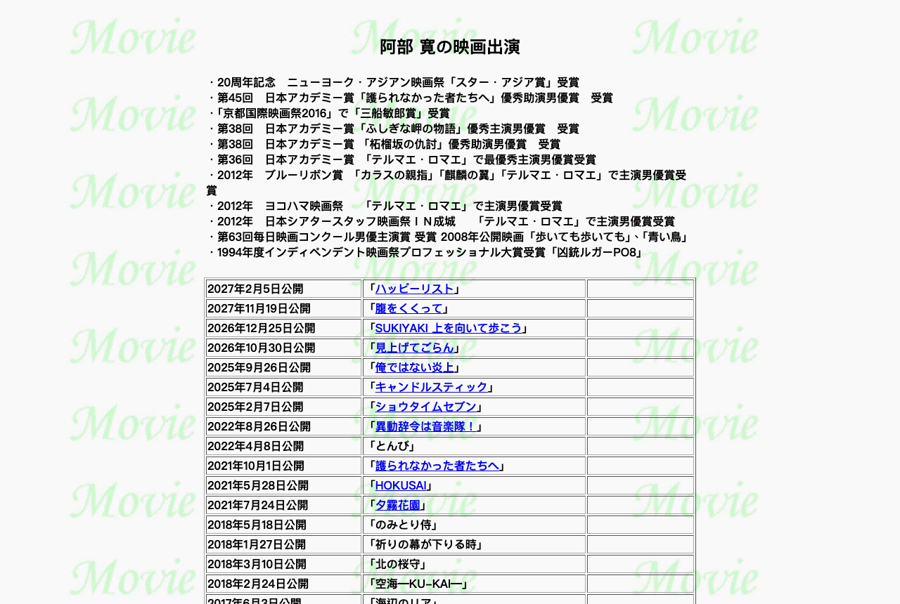
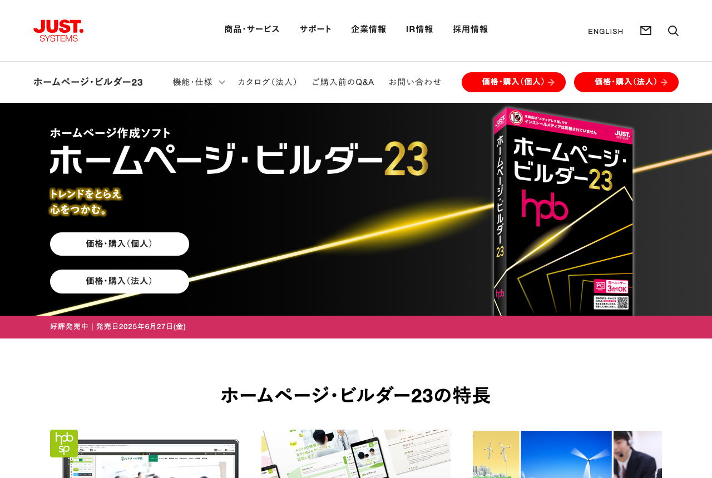
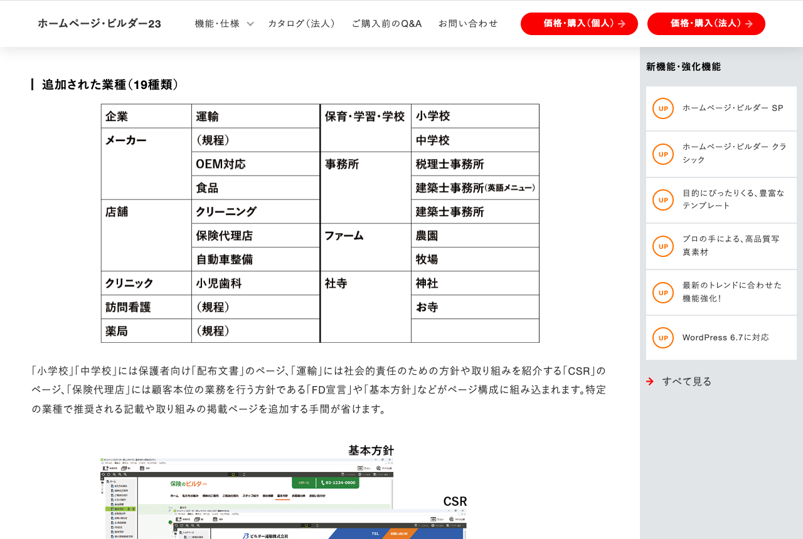

在日本網路圈，[阿部寬](https://ja.wikipedia.org/wiki/%E9%98%BF%E9%83%A8%E5%AF%9B)的官方網站是個老梗。它以載入快出名，快到有人拿它來測網路：Wi-Fi 連不太上的時候，先打開阿部寬的網站，確認不是 Wi-Fi 本身的問題。

我是先知道這個梗，後來才真的點進去。畫面左邊一排文字連結，右邊一張本人照片，背景淡淡印著「ABE Hiroshi」。沒有 cookie 同意視窗，沒有電子報訂閱彈窗，也沒有任何動畫。

工程師的習慣，看到這種網站就想按右鍵檢視原始碼。看完我發現兩件跟「老梗」的印象不太一樣的事。這個網站四天前才更新過，而且主機商已經公告，2026 年 7 月起不支援 HTTPS 的機器就連不上它了。

## Table of contents

## 一份還在更新的 HTML 標本

[首頁](https://abehiroshi.la.coocan.jp/)是一個 frameset。畫面被切成左右兩個獨立的 HTML 檔，左邊是選單 `menu.htm`，右邊才是內容 `top.htm`。這種框架技術今天幾乎看不到了，[HTML5 規格](https://html.spec.whatwg.org/multipage/obsolete.html)也早就把它列為廢棄。

內頁的寫法更有年代感。以[演出作品頁](https://abehiroshi.la.coocan.jp/movie/eiga.htm)為例，用 `<BODY BACKGROUND>` 設背景圖、`<CENTER>` 置中標題，再用 `<TABLE BORDER=1 width="700">` 把出演紀錄一格一格排好。CSS 只出現在一個 `.style1{color:#FF0000}` 的規則裡，版面全靠表格撐起來。標籤大小寫混用，`<title>` 開頭配 `</TITLE>` 結尾，是手改過的痕跡。



副檔名以 `.htm` 為主，還帶著副檔名只能用三個字元那個年代的氣息。文字編碼是 Shift_JIS，2015 年就有工程師把它收進「[各種奇特編碼網站](https://gist.github.com/nekova/f213ef640ef6b49b864e)」的清單。把這些頁面丟給不處理編碼的爬蟲，抓回來會是一整片亂碼。

然後我在 `<head>` 裡看到這一行：

```html
<meta
  name="GENERATOR"
  content="JustSystems Homepage Builder Version 23.0.2.0 for Windows"
/>
```

Homepage Builder 我有印象，但 JustSystems 是誰？還有，這麼舊的網頁，為什麼會寫著第 23 版？

### 八個檔案，四個地層

我把選單上的連結全抓下來，比對每個檔案的 generator 字串和 HTTP 的 `Last-Modified`。結果比我預期的有意思：

| 檔案                        | generator | 最後修改   |
| --------------------------- | --------- | ---------- |
| `kanri/kanri.htm`           | 無        | 2007-05-06 |
| `index.htm`                 | 無        | 2009-12-21 |
| `essay/essay.htm`           | 20.0.6.0  | 2021-05-29 |
| `photo/photo.htm`           | 20.0.6.0  | 2022-04-05 |
| `index.html`                | 20.0.6.0  | 2025-07-09 |
| `tv/tv.htm`                 | 23.0.1.0  | 2026-04-05 |
| `stage/butai.htm`           | 23.0.1.0  | 2026-08-12 |
| `menu.htm`、`english.htm`   | 23.0.2.0  | 2026-08-31 |
| `top.htm`、`movie/eiga.htm` | 23.0.2.0  | 2026-09-17 |

（以上為 2026 年 9 月 21 日的查詢結果。）

這個網站現在還在更新。首頁和演出作品頁四天前才動過，選單三週前動過。它不是一份被遺忘的靜態存檔。

`kanri/kanri.htm` 是管理者頁面，2007 年 5 月之後沒再改。上面只有兩句話：「情報等については、所属事務所の協力と承認を得て作成しています」、「写真の無断転載は禁止いたします」。十九年沒動的一頁，說明這個網站不是事務所自己在經營。

真正載入的外框是 `index.html`，generator 停在第 20 版。旁邊還躺著一個 `index.htm`，2009 年 12 月之後沒人碰過，`charset` 寫的是 `x-sjis`（Shift_JIS 更早的一種寫法），frameset 的屬性連引號都沒加。它已經沒有作用，但檔案還在伺服器上。

內容頁跟著管理者升級到第 23 版，外框那一層留在第 20 版，最外面還有一塊 2009 年的殘骸。

### 從 Trial 到正式授權

我接著去 Internet Archive 抓 `top.htm` 歷年的快照，想知道 generator 換過幾次。

2016 年 9 月到 2019 年 3 月的快照，寫的都是 `Version 16.0.0.2 Trial for Windows`。第 16 版是 2011 年 10 月的產品，Trial 是 JustSystems 的 30 天體驗版。也就是說，那幾年這個網站是用一套五年前的軟體的試用版在維護。

2019 年 4 月底到 7 月的快照，`<head>` 裡完全沒有 generator。這段空窗期的檔案開頭反而留著 `<!-- saved from url=(0022)http://internet.e-mail -->`，那是 Internet Explorer 存檔時寫進去的標記。

2019 年 8 月的快照開始出現 `Version 20.0.6.0`，Trial 兩個字不見了。第 20 版是 2015 年的產品。

第 23 版在 2025 年 6 月 27 日發售。管理者買了，而且是有效授權：第 23 版的升級版只開放給第 12 到 22 版的註冊用戶，升級版售價 22,880 日圓，完整版 29,700 日圓，兩種都只能在 JustSystems 自家的 Just MyShop 買。無論買的是哪一種，都代表有人為了維護這個網站付過錢。

付了錢，網站卻沒有變得現代。原因在第 23 版的相容性設計裡。官方 Q&A 寫得很直接：舊版 HPB 做的網頁，用第 23 版的「クラシック」繼續編輯；第 23 版同時內建「SP」和「クラシック」兩套軟體，但「互換性はありません」。SP 打不開 クラシック 做的網站，反之亦然，範本也不能互換。管理者是在 2025 年的軟體裡打開這些 frameset 和表格排版的舊網頁，改完內容存檔，結構沒有變，只有 generator 那一行換了數字。

## JustSystems：一太郎的公司，現在靠平板補習班賺錢

對台灣讀者來說，[JustSystems](https://www.justsystems.com/jp/)（ジャストシステム）可能很陌生。它 1979 年 7 月在德島市創業，招牌產品是日文文書處理軟體「[一太郎](https://ja.wikipedia.org/wiki/%E4%B8%80%E5%A4%AA%E9%83%8E)」（1985 年）和日文輸入法「[ATOK](https://ja.wikipedia.org/wiki/ATOK)」（前身 KTIS 是 1982 年）。Windows 普及後，市場被 Microsoft Word 搶走，2000 年代前半連年虧損，一度陷入困境。

JustSystems 在日本的地位，大概可以想成中國的[金山辦公](https://www.wps.cn/)。兩家都是在 DOS 時代稱霸本國語言市場的文書軟體公司，也都在 Windows 時代被 Word 打敗。差別在後來。金山靠政府的國產化政策和 AI 在辦公軟體戰場反攻，2025 年營收 59.29 億人民幣，成長 15.78%，主力仍是 WPS；JustSystems 則轉去做平板補習班。台灣沒有類似的公司，最接近的可能是做 PDF 和電子簽章起家的台南公司[凱鈿](https://www.kdan.com/zh-tw)，但它從 2009 年創立就是面向國際的 App 公司，沒有經歷過本國語言文書軟體的那段歷史。

### KEYENCE 進來以後

轉折點是 2009 年 4 月。[KEYENCE](https://www.keyence.co.jp/) 與 JustSystems 簽下資本業務合作契約，成為最大股東，創業者夫婦也在這時退出經營。KEYENCE 就是那家以高毛利、高薪聞名的日本工業感測器公司。

效果來得很快。2012 年 12 月，JustSystems 推出平板學習的通信教育服務「[スマイルゼミ](https://smile-zemi.jp/)」，很早就在教育市場站穩，後來成為經營的主要支柱。這家公司現在最賺錢的是平板補習班。

2026 年 3 月期的數字：營收 515 億日圓，年增 15.6%；營業利益 224.9 億日圓，年增 24.7%；淨利 150.9 億日圓。營業利益率 43.7%。訂閱型的存量業務佔全公司營收 71.4%，法人端成長 34.8%。

有一組數字更能說明這家公司的型態。有價證券報告書上的員工人數是 293 人，平均年收 1,650 萬日圓。十二年前（2014 年 3 月期）是 377 人、827 萬日圓。人變少，薪水翻倍，515 億日圓的營收攤到 293 個人身上，一個人一億七千多萬日圓。KEYENCE 的影子很明顯。

一太郎和 ATOK 都還在。ATOK Passport 在 2026 年 2 月加入了生成式 AI 寫作助理「ATOK MiRA」，6 月擴及 macOS、Android 和 iOS。法人端有無程式碼雲端資料庫「JUST.DB」、營業支援「JUST.SFA」和 BI 工具「Actionista!」。至於 Homepage Builder，仍然列在個人產品線裡。官網的商品一覽把スマイルゼミ 排在最前面，往下才是 ATOK、一太郎、JUST Office，然後才輪到它。

## Homepage Builder：IBM 生的孩子

HPB 的出身和我以為的不一樣。它不是 JustSystems 自己開發的。

第一版 1994 年推出，由[日本 IBM 大和研究所](https://ja.wikipedia.org/wiki/%E6%97%A5%E6%9C%ACIBM%E5%A4%A7%E5%92%8C%E4%BA%8B%E6%A5%AD%E6%89%80)開發，當時叫「IBM ホームページ・ビルダー」。V1.0 到 V8 由日本 IBM 一手開發販售；V9 和 10 加進了[ソースネクスト](https://www.sourcenext.com/)和 ジャングル 兩家通路；V11 一度給了 ソースネクスト 獨家販售權，後來 IBM 又透過 JustSystems 賣給教育機構和政府機關，引發訴訟，2008 年 7 月才全部和解；V12 到 V14 定案成 IBM 開發、JustSystems 獨家販售。

2010 年 2 月 16 日，JustSystems 從日本 IBM 手上買下程式著作權和商標權。同年 12 月推出的第 15 版，是它第一次自行開發的版本。

這套軟體在日本的普及程度超過我原本的想像。[IPA](https://www.ipa.go.jp/) 2006 年的調查發現，用網頁製作工具做的日文網站裡，超過 68% 是 HPB 做的。JustSystems 自己的宣傳說法是，1999 年 10 月起連續十三年拿下網頁製作工具套裝軟體銷售第一。

### 第 15 版那個轉彎

第 15 版除了是 JustSystems 自製的第一版，還做了一件事：版面不再用表格調整，全部改用 CSS。

這剛好標出阿部寬那個網站落在哪一邊。它的結構是 V15 之前的東西：frameset 加表格排版。V15 之後的 HPB 新建網頁已經不長那樣了。舊網頁沒有被強制轉換，繼續用舊的編輯器開。到了第 19 版（2014 年），HPB 把介面整個改成拖放式的「SP」，同時把原本那個編輯器正式命名為「クラシック」保留下來。阿部寬的網站從頭到尾用的都是 クラシック。

之後 HPB 一路跟著網路潮流修改。第 17 版（2012 年）支援 WordPress，把自己定位成 WordPress 主題的設計工具；第 20 版（2015 年）大幅增加響應式設計的範本。最新的第 23 版在 2025 年 6 月 27 日發售，距離第 22 版（2020 年 4 月）隔了五年多。以前一年一版的節奏，現在變成五年一版。這條產品線還活著，但已經是在照顧老用戶了。

## 為什麼 2025 年還賣得動



一套 Windows 專用、買斷制的網頁軟體，要在本機編輯再上傳到租用主機，面對 [Wix](https://zh.wikipedia.org/zh-tw/Wix.com)、[Jimdo](https://www.jimdo.com/)、[STUDIO](https://studio.design/ja) 和 [WordPress](https://wordpress.org/)，憑什麼還能推出第 23 版？翻完第 23 版的新功能清單，我覺得答案不在技術，在兩件很「日本」的事情上。

### 神社與小兒牙科的範本

第一件是在地化的麻煩事。第 23 版新增 20 種設計範本，SP 範本因此來到 120 種，全機共 372 種；搭配 70 種「業種」資訊，官方號稱組合起來有 9,700 種以上。

真正有意思的是那 70 種業種怎麼來的。第 23 版一口氣追加了 19 種，清單裡有食品、小兒牙科、農園、牧場、洗衣店、保險代理店、稅理士事務所，還有一類叫「社寺」，底下分成神社和寺廟。你很難想像海外的網站建置服務，會替神社準備一套專用的頁面構成。



### 醫療法規的截止日

更關鍵的是醫療法規。剛才那 19 種新業種裡，「クリニック」「訪問看護」「薬局」三種被單獨挑出來處理：[官方功能說明](https://www.justsystems.com/jp/products/hpb/features/feature02.html)寫著，這三種業種的頁面構成裡已經預先放進「書面掲示事項等」的頁面，使用者只要把自己的資料填進去。

這背後是 2024 年度（令和 6 年度）的診療報酬改定。過去只需要貼在院內的揭示事項，改成原則上必須放上網站。這項規定設了一年的經過措置，[全國保險醫團體連合會](https://hodanren.doc-net.or.jp/)的說明是「該当する医療機関においては 5 月末までに対応が必要となる」，2025 年 6 月 1 日起義務化。

時間點對得非常準。JustSystems 在 2025 年 5 月 23 日發表第 23 版，6 月 27 日上市，剛好接在經過措置結束之後。日本有大量由院長自己維護網站的小診所，這個功能等於直接回應了他們最急迫的需求。

規定還有一個細節：義務對象限於「自ら管理するホームページを有する医療機関」，沒有自己管理網站的就不適用，院內揭示即可。換句話說，只要你有網站，就得持續更新。2026 年度的改定又動了一部分揭示內容，維護工作不會結束。

### 十九年前的用戶還算客戶

第二件是老用戶。第 23 版的升級版開放給第 12 到 22 版的註冊用戶，第 12 版是 2007 年 12 月的產品。一套軟體的升級版還收十九年前的用戶，等於承認這群人是主要客源。加上 クラシック 能繼續編輯舊版做的網頁，老用戶升級的成本很低，換到別的平台反而要重做整個網站。阿部寬的網站就是這種用戶的極端版本。

HPB 另外還有一筆收入：2011 年 7 月開始的「[ホームページ・ビルダー サービス](https://hpbs.jp/)」租用主機方案，現在是 10GB 月付 1,980 日圓、50GB 月付 3,982 日圓。單看價格比自行租用主機貴，但對不熟網路的初學者來說，軟體和主機一起買最省事。盒裝軟體賣一次，主機費是每個月收。

阿部寬的網站並沒有用這個方案。它掛在 Nifty 的 [LaCoocan](https://lacoocan.nifty.com/) 上。管理者買軟體，但主機是另外一家。

HPB 的更新節奏從一年一版拉長到五年一版，我不覺得是產品在凋零。它的客戶是那群被日本法規和舊網站綁住、又不想換工具的小型事業主，這種客戶不會因為雲端工具功能更多就跑掉。

## 回到阿部寬

這個網站會長成這樣，是有原因的。它原本是阿部寬的粉絲做的應援網站，後來才被事務所認可，變成官方網站。

2016 年，網站原本使用的 Nifty「@homepage」服務結束，網站因此搬到 `la.coocan.jp`，但設計一個字都沒改。阿部當時所屬的[茂田オフィス](https://ja.wikipedia.org/wiki/%E8%8C%82%E7%94%B0%E3%82%AA%E3%83%95%E3%82%A3%E3%82%B9)在 2021 年 4 月表示，因為是粉絲做的網站，沒有改版計畫。

阿部本人也表態過兩次。2022 年 4 月 5 日他對 [スポーツ報知](https://hochi.news/articles/20220405-OHT1T51092.html)說：「非常にシンプルで気に入っています。作っていただいて感謝です。」三天後，電影《[とんび](<https://ja.wikipedia.org/wiki/%E3%81%A8%E3%82%93%E3%81%B3_(%E5%B0%8F%E8%AA%AC)>)》首日舞台上，共演的[安田顕](https://ja.wikipedia.org/wiki/%E5%AE%89%E7%94%B0%E9%A1%95)說「您該更新一下自己的官方網站了吧」，阿部回「でも、あれ人気だから」（那個很受歡迎）。

這個網站還卡在一個很現實的處境裡。因為「速度快」的名聲太響，這個網站反而很難改，一旦改版變慢，網路上就會一片失望。對非專業的管理者來說，連 HTTPS 和手機版這種理所當然的改善，可能都會怕。

### HTTPS 來了，古董電腦還連得上

HTTPS 最後還是來了，而且不是管理者的決定。

Nifty 在 2025 年 8 月 7 日宣布 LaCoocan 的方案調整：免費的迷你方案 9 月底結束，付費方案漲價，同時全方案支援 HTTPS。10 月 1 日起依序開通，[ITmedia](https://www.itmedia.co.jp/news/articles/2508/27/news086.html) 8 月 27 日的報導標題直接把重點放在阿部寬，還記下了網友的反應：「阿部寛でレトロ PC の接続確認できなくなる」。同年 10 月 31 日前，這個網站完成了 HTTPS 對應。這件事在日本 X 上登上熱門趨勢，有人說「一個時代結束了」。

擔心的是 Nifty 的時程表下半段：2026 年 6 月底之前是 http 和 https 併用期，7 月 1 日起 http 會自動轉到 https，不支援 HTTPS 的舊機器就連不上了。

我在 2026 年 9 月 21 日用 `curl` 試了一次，`http://abehiroshi.la.coocan.jp/` 仍然直接回 `200 OK`，沒有轉址。至少在這一天，用古董電腦連阿部寬的網站還是可行的。

### 有人想讓它更快

2022 年 7 月，YouTuber コスメティック田中 做了一個複製站，試著讓它更快。他把 `.jpg` 換成 `.webp`、把背景那張文字圖片改用相近字型的文字資料重現、合併檔案、整理原始碼，再放上 AWS CloudFront，檔案大小從 37.5 KB 壓到 9.5 KB，[ねとらぼ](https://nlab.itmedia.co.jp/cont/articles/3340137/)的報導說約快了 35%。把傳輸速度限制在 5 KB/s 時，差距非常明顯。

我自己算了一次現在的首頁：`index.html` 538 bytes、`menu.htm` 2,843 bytes、`top.htm` 5,025 bytes，加上背景圖 3,104 bytes 和人像 26,147 bytes，總共 36.7 KB。四年過去，數字幾乎沒變。

那 35% 有一半以上是圖片換格式換來的。HTML 本身已經沒有什麼可以再精簡的了：五千個位元組的 `top.htm`，扣掉出演紀錄的文字，剩下的就是表格標籤。

## 一行 meta 背後的兩條路

回頭看，這行 generator 字串把一家公司和一個產品寫在同一行，但兩者後來的際遇差很多。

JustSystems 從賣盒裝軟體，轉型成賣訂閱制教育服務，用 KEYENCE 式的經營管理做到四成以上的營業利益率，293 個人撐起 515 億日圓。HPB 則留在舊世界，繼續賣給需要在自己電腦上做網頁、再用 FTP 上傳的中小企業和學校。

阿部寬的網站大概是 HPB 最有名的長期用戶。從 2016 年還在用第 16 版的試用版，到 2026 年 9 月拿第 23 版存檔，frameset、表格排版、Shift_JIS 都還在，外框甚至還停在第 20 版。工具跨了七個大版本，網頁結構一點都沒有動。

這種向後相容，在現代前端生態裡很少見。一個前端專案放兩年沒碰，重新 `npm install` 往往就要花一個下午處理相依套件的衝突。HPB 則讓一份 2000 年代的網頁，在 2025 年的軟體裡照常打開、照常存檔。

查完這些之後，我對「這個網站為什麼沒變」的理解和一開始不太一樣。管理者不想改只是一半，另一半是那套二十年不破壞舊檔案的軟體到今天還在賣。反過來說，真正逼它改變的也不是任何人的決定，是主機商的排程表上寫了 HTTPS。

我不確定 JustSystems 會不會想把這件事寫進行銷文案。一個二十幾年沒改版的網站，管理者去年還是付了兩萬多日圓買升級版。他買到的東西，就是這個網站可以繼續不變。
