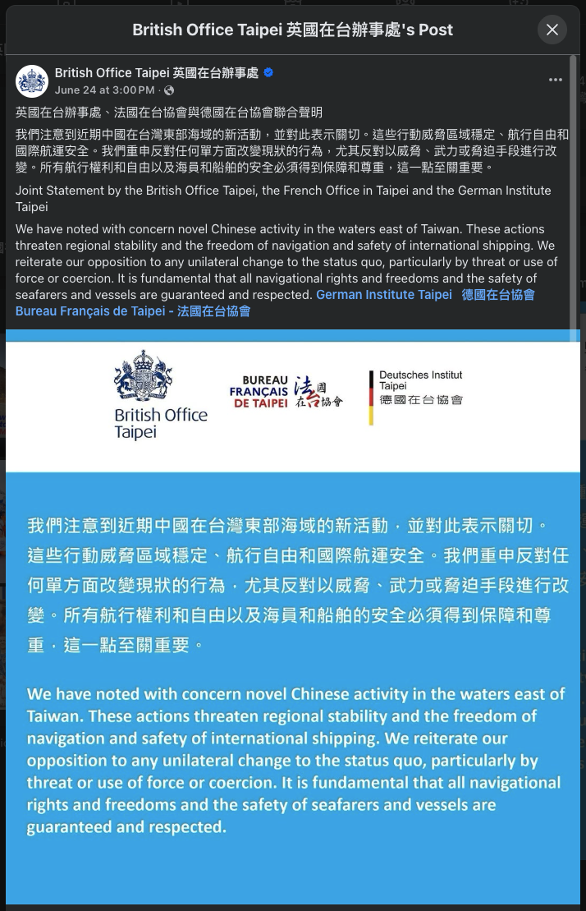
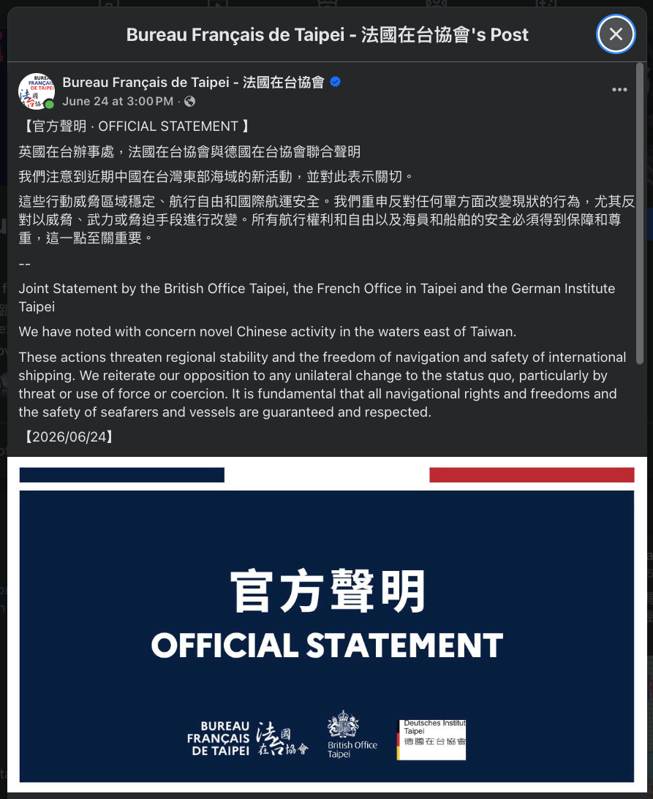
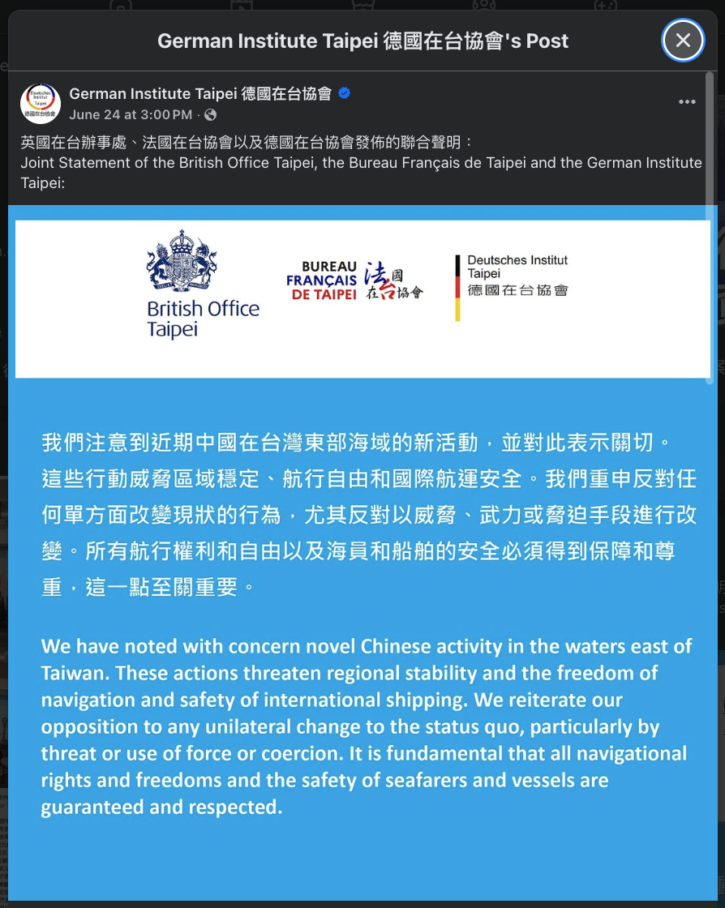

2026 年 6 月初，一則海事新聞在台灣社群上燒起來：中國海警在台灣本島以東的海域，向往來的外國商船直接「行使權力」，在為期五天的行動裡查驗了將近兩百艘船。中國官方說這是「執法」，是在「中國管轄水域」內維護主權與海洋權益。美國在台協會（AIT）發言人[受訪時表示](https://news.ltn.com.tw/news/politics/breakingnews/5482716)中國嚴重破壞區域穩定，拒絕中國任何干涉航行自由的主張；英、法、德三國駐台機構則在 6 月 24 日發表聯合聲明，說中國的行動威脅區域穩定、航行自由與國際航運安全，重申反對任何單方面改變現狀的行為，尤其反對以威脅、武力或脅迫手段進行改變。

同一批船、同一批動作，一邊叫「執法」，一邊叫「脅迫」。這不是翻譯問題，是兩套互不相容的法律框架在搶同一片海的命名權。誰的命名被國際社會接受，誰就在法理上佔住了那片海。

要看懂這場命名權之爭，得先把這個動作放回它真正所屬的位置：它不是經濟抵制（boycott）或禁運（embargo）的前一步，而是中國在海上直接對台灣動手的起手式。海上動手有一整套由輕到重的階梯，從「主張管轄」一路爬到「封鎖」，每一格的訣竅都一樣：停在「可以被講成執法」的法律閾值之內。

## Table of contents

## 法律地基：為什麼「非領海」是關鍵

事件發生在「非領海」，這正是要害所在。

依《[聯合國海洋法公約](https://zh.wikipedia.org/wiki/聯合國海洋法公約)》（UNCLOS），一國對外海的權利不是全有全無，而是隨著離岸距離分層遞減：

| 海域                                                           | 範圍                                                     | 沿海國的權力                                       |
| -------------------------------------------------------------- | -------------------------------------------------------- | -------------------------------------------------- |
| [領海 territorial sea](https://zh.wikipedia.org/wiki/領海)     | [基線](https://zh.wikipedia.org/wiki/領海基線)起 12 海里 | 完整主權，但須容許外國船「無害通過」               |
| [鄰接區 contiguous zone](https://zh.wikipedia.org/wiki/毗連區) | 12 至 24 海里                                            | 僅限海關、財政、移民、衛生四類執法（第 33 條）     |
| [專屬經濟區 EEZ](https://zh.wikipedia.org/wiki/專屬經濟區)     | 領海外緣至 200 海里                                      | 只有「資源」主權權利（漁業、海床），沒有航行管轄權 |

關鍵在最後一列。在 EEZ 內，所有國家的船舶都享有航行自由（UNCLOS 第 58 條），有權直接通過，不需要向沿海國通報船籍、航線或船員名單。

所以中國海警要求商船回報這些資訊，在海洋法上沒有依據。這不是執法，而是用執法的形式，去製造出一個並不存在的管轄權事實。它要的其實是商船「照做」這個動作本身。只要船隻開始回報，就等於用行為承認了中國在那片海有權發號施令。這是典型的 lawfare（法律戰），靠重複與默認，把一個空殼主張一點一點坐實。它要的是製造既成事實（fait accompli）：趁對方還在猶豫該不該反應，先把一個有爭議的狀態做成「木已成舟」的現實，等對方想爭，現狀已經改了，連舉證的責任都悄悄換到了對方身上。

## 經濟施壓和海上動手，是兩回事

很多人第一時間把這件事接到「中國又要對台灣搞經濟制裁」的脈絡上，把它想成 boycott 或 embargo 的前一步。這個直覺搞錯了對象。

boycott 與 embargo 是經濟手段，海警在海上攔船則是另一回事。兩者最根本的差別，在於需不需要有船真的開到海上去。

經濟手段是政府層級的貿易管制。中國要禁運台灣的東西，直接在自家港口拒收、或禁止本國企業交易就行，不必派出任何一艘船。這種事中國早就做過好幾輪了，鳳梨、石斑魚的禁令就是一次次定點式的小型 embargo。

海上動手就不一樣，非得有船不可。它要靠海警或海軍實際出現在現場，對特定船隻做出攔阻、檢查、驅離的動作。下面要拆的這道升級階梯，講的全是海上這一邊。

## 海上動手的升級階梯

把中國能在海上做的事由輕到重攤開，會看到一道界線分明的升級階梯。中國目前停在第一級。

| 級別         | 行為                          | 中國的法律包裝                   | 實際國際法定性                                     | 歷史先例／案例                                      |
| ------------ | ----------------------------- | -------------------------------- | -------------------------------------------------- | --------------------------------------------------- |
| 0            | 自由航行                      | （現狀）                         | UNCLOS 第 58、87 條保障的航行自由                  | 常態                                                |
| **1 ← 現在** | 主張管轄、要求商船通報        | 「特別海上交通執法」、行使管轄權 | 對航行自由的非法干預，捏造 EEZ 管轄權              | 中國 2026 台灣東部海域行動；2013 東海 ADIZ 同型套路 |
| 2            | 登船臨檢、開罰、扣留          | 海關／安全檢查                   | EEZ 內對外國商船無此權限，屬偽裝的海關管轄         | 2024 金門撞船案後，中國開始登檢金廈觀光船           |
| 3            | 選擇性攔阻特定船隻            | 針對「違規」船隻執法             | 鎖定特定船籍或貨物，近似戰時臨檢拿捕權，平時無依據 | 中國在南海對菲律賓補給船的攔阻                      |
| 4            | 檢疫隔離 quarantine           | 對「境內」港口船舶的內政檢查     | 灰色地帶混血兒，效果近封鎖但規避開戰定性           | 概念先例見古巴 1962（見下節）                       |
| 5            | 和平封鎖 pacific blockade     | 不宣戰的封鎖                     | 19 世紀大國對弱國的爭議手段，現代國際法地位不明    | 1902 委內瑞拉封鎖；1838 法墨「糕點戰爭」            |
| 6            | 全面封鎖 belligerent blockade | （難以包裝）                     | 戰爭行為，受 1909 倫敦宣言／San Remo 手冊規範      | 1861 北方對南方封鎖；兩次世界大戰                   |

<svg class="escalation-ladder" viewBox="0 0 680 646" xmlns="http://www.w3.org/2000/svg" role="img" style="max-width:680px;width:100%;height:auto;display:block;margin:1.5rem auto">
<title>中國對台海上脅迫的升級階梯</title>
<desc>從合法航行到全面封鎖的七級升級梯，標示 UNCLOS 航行自由界線與開戰行為門檻兩道閾值，目前事件位於第一級。</desc>

<rect x="0" y="0" width="680" height="646" fill="var(--background)"/>

<rect x="60" y="44" width="400" height="54" rx="8" fill="var(--red)" fill-opacity="0.12" stroke="var(--red)" stroke-width="0.75"/>
<text class="th" fill="var(--red)" x="260" y="64" text-anchor="middle" dominant-baseline="central">全面封鎖</text>
<text class="ts" fill="var(--red)" fill-opacity="0.85" x="260" y="82" text-anchor="middle" dominant-baseline="central">belligerent blockade・戰爭行為</text>

<line x1="40" y1="120" x2="455" y2="120" stroke="var(--red)" stroke-width="1.5" stroke-dasharray="6 5"/>
<text class="ts" fill="var(--red)" x="463" y="124">開戰行為門檻 act of war</text>

<rect x="60" y="128" width="400" height="54" rx="8" fill="var(--amb)" fill-opacity="0.1" stroke="var(--amb)" stroke-width="0.75"/>
<text class="th" fill="var(--amb)" x="260" y="148" text-anchor="middle" dominant-baseline="central">和平封鎖</text>
<text class="ts" fill="var(--amb)" fill-opacity="0.85" x="260" y="166" text-anchor="middle" dominant-baseline="central">pacific blockade・準戰爭手段</text>

<rect x="60" y="198" width="400" height="54" rx="8" fill="var(--amb)" fill-opacity="0.16" stroke="var(--amb)" stroke-width="1.75"/>
<text class="th" fill="var(--amb)" x="260" y="218" text-anchor="middle" dominant-baseline="central">檢疫隔離</text>
<text class="ts" fill="var(--amb)" fill-opacity="0.85" x="260" y="236" text-anchor="middle" dominant-baseline="central">quarantine・灰色地帶核心</text>

<rect x="60" y="268" width="400" height="54" rx="8" fill="var(--amb)" fill-opacity="0.1" stroke="var(--amb)" stroke-width="0.75"/>
<text class="th" fill="var(--amb)" x="260" y="288" text-anchor="middle" dominant-baseline="central">選擇性攔阻</text>
<text class="ts" fill="var(--amb)" fill-opacity="0.85" x="260" y="306" text-anchor="middle" dominant-baseline="central">鎖定特定船籍或貨物</text>

<rect x="60" y="338" width="400" height="54" rx="8" fill="var(--amb)" fill-opacity="0.1" stroke="var(--amb)" stroke-width="0.75"/>
<text class="th" fill="var(--amb)" x="260" y="358" text-anchor="middle" dominant-baseline="central">登船臨檢、開罰、扣留</text>
<text class="ts" fill="var(--amb)" fill-opacity="0.85" x="260" y="376" text-anchor="middle" dominant-baseline="central">偽裝成海關管轄</text>

<rect x="60" y="408" width="400" height="54" rx="8" fill="var(--amb)" fill-opacity="0.16" stroke="var(--amb)" stroke-width="1.75"/>
<text class="th" fill="var(--amb)" x="260" y="428" text-anchor="middle" dominant-baseline="central">主張管轄、要求通報</text>
<text class="ts" fill="var(--amb)" fill-opacity="0.85" x="260" y="446" text-anchor="middle" dominant-baseline="central">捏造 EEZ 管轄權</text>

<path d="M460 435 L472 429 L472 441 Z" fill="var(--accent)"/>
<text class="th" fill="var(--accent)" x="478" y="431" dominant-baseline="central">現在事件</text>
<text class="ts" fill="var(--accent)" fill-opacity="0.85" x="478" y="448" dominant-baseline="central">（你看到的新聞）</text>

<line x1="40" y1="484" x2="455" y2="484" stroke="var(--accent)" stroke-width="1.5" stroke-dasharray="6 5"/>
<text class="ts" fill="var(--accent)" x="463" y="488">UNCLOS 航行自由界線</text>

<rect x="60" y="492" width="400" height="54" rx="8" fill="none" stroke="var(--border)" stroke-width="1"/>
<text class="th" fill="var(--foreground)" x="260" y="512" text-anchor="middle" dominant-baseline="central">自由航行</text>
<text class="ts" fill="var(--foreground)" fill-opacity="0.6" x="260" y="530" text-anchor="middle" dominant-baseline="central">UNCLOS 航行自由保障</text>

<rect x="60" y="566" width="14" height="14" rx="3" fill="var(--red)" fill-opacity="0.12" stroke="var(--red)" stroke-width="0.75"/>
<text class="ts" fill="var(--foreground)" fill-opacity="0.75" x="82" y="577">全面封鎖 = 戰爭行為，等同開戰</text>
<rect x="60" y="590" width="14" height="14" rx="3" fill="var(--amb)" fill-opacity="0.12" stroke="var(--amb)" stroke-width="0.75"/>
<text class="ts" fill="var(--foreground)" fill-opacity="0.75" x="82" y="601">灰色地帶：已違反 UNCLOS，但低於開戰門檻</text>
<rect x="60" y="614" width="14" height="14" rx="3" fill="none" stroke="var(--border)" stroke-width="1"/>
<text class="ts" fill="var(--foreground)" fill-opacity="0.75" x="82" y="625">合法航行：UNCLOS 明文保障的航行自由</text>
</svg>

### 兩道閾值線

這道階梯被兩條線切成三段。

第一條是 UNCLOS 航行自由界線，落在第 0 與第 1 級之間。一旦越過，行為在海洋法上就不再合法。中國目前已經越過這條線。

第二條是開戰行為門檻（act of war），落在第 5 與第 6 級之間。一旦越過，行為在國際法上等同對台動武。

兩條線中間那一大段——第 1 到第 5 級——就是「已經違反 UNCLOS，但刻意維持在開戰門檻之下」的灰色地帶，這整段是中國的戰略主場。被脅迫的一方在這裡會陷入兩難：反應過度顯得挑釁，反應不足等於默許。台灣海巡採取的「併航監控、廣播驅離、全程蒐證」，正是想在不上鉤的前提下，守住 UNCLOS 那條界線。

## quarantine：整套操作的樞紐

這道階梯裡，真正的樞紐是第四級的檢疫隔離（quarantine）。

近年美方智庫推演台海情境時，quarantine 是反覆出現的核心想定，也被普遍認為比全面封鎖更可能被中國率先採用。它的設計邏輯是：用海警而不是海軍，對進出台灣港口的船隻進行「海關或安全檢查」，在效果上達成接近封鎖的絞殺，卻刻意避開「封鎖等同戰爭行為」的定性。它替自己想好的法律說詞很簡單：既然中國宣稱台灣是它的領土，那它檢查自己「境內」港口的船，就算內政，不算對外動武。

最好用的歷史對照，是 1962 年的[古巴飛彈危機](https://zh.wikipedia.org/wiki/古巴飛彈危機)。當時甘迺迪政府刻意選用 quarantine（隔離）而不用 blockade（封鎖）這個詞，正因為封鎖在國際法上是戰爭行為，而「隔離」可以閃過這個定性。同一套「換一個詞以規避法律後果」的操作，中國今天若對台灣施行，劇本幾乎一模一樣。

回頭看，現在這個第一級的「要求商船通報」，就是在替 quarantine 鋪路：先把管轄主張與海警的常態存在立起來，再把資訊回報的習慣養成。下一步才是真的開始「檢查」，再下一步，是開始把船「請回去」。

## 到了頂端，兩者合而為一

講到這裡，最初那個「搞錯對象」的直覺，反而在階梯頂端對上了。

階梯最頂端的 blockade（封鎖），本質上就是「對台灣海運貿易的全面 embargo，只是改用艦艇來物理執行」。換句話說，embargo 與 blockade 是同一件事的兩張臉：一張在北京的商務部門拍板，一張靠海上的船去執行。而 quarantine 就是那個刻意做得模稜兩可的混血兒，披著海警「執法」的外衣，去取得 embargo 的絞殺效果。

這跟四十多年前《[台灣關係法](https://www.ait.org.tw/policy-history/taiwan-relations-act/)》的措辭正好對得上。1979 年美國國會在第二條（Section 2(b)）裡寫下：

> (4) to consider any effort to determine the future of Taiwan by other than peaceful means, including by boycotts or embargoes, a threat to the peace and security of the Western Pacific area and of grave concern to the United States;
>
> (6) to maintain the capacity of the United States to resist any resort to force or other forms of coercion that would jeopardize the security, or the social or economic system, of the people on Taiwan.

第 (4) 款把 boycotts or embargoes（杯葛、禁運）跟「非和平方式」綁在一起，第 (6) 款則把 force or other forms of coercion（武力或其他形式的脅迫）列為美國必須有能力抵抗的對象。兩款合起來，涵蓋的正是這整道光譜：從不流血的經濟禁運，一路到靠武力強制的海上封鎖，全都算進「非和平方式」與「脅迫」。當年的立法者沒見過今天的海警船，但他們框出的範圍，剛好把這道階梯整條罩了進去。

## 命名權之爭：執法 vs 脅迫

所以回到最開頭那個畫面：同一艘海警船，為什麼一邊叫執法、一邊叫脅迫？

因為這是一場命名權之爭，而命名權之爭本身，就是這場博弈的本體。

中國的說法是：執法、行使管轄權、維護主權與海洋權益。美歐的說法是：[coercion](https://en.wikipedia.org/wiki/Coercion)（脅迫）。英、法、德三國駐台機構的聯合聲明，用的是「威脅、武力或脅迫」；美國在台協會發言人則更直接，否認中國有任何干涉航行自由的權限。兩套說法背後真正的裁判是 UNCLOS，端看你承不承認那片海域中國有沒有發號施令的權利。

英、法、德三國駐台機構在各自的官方臉書同步貼出同一份聯合聲明，中英對照，措辭一字不差：

這個措辭不是 2026 年才出現的。前面引的 1979 年那句 force or other forms of coercion，和三國聲明裡的「威脅、武力或脅迫」其實是同一個句式：把「武力」跟「脅迫」並列，再把脅迫的範圍刻意做大到經濟與海上層面。這是西方對台政策語言用了四十多年的固定結構。中國則始終用「執法」來抵銷這個命名，一邊擴大 coercion 的定義，一邊否認 coercion 的存在。

## 結語：要守的是命名權

這則海事新聞看起來很技術，其實有兩層。表層是海洋法：在 EEZ 裡要求商船通報，違反 UNCLOS 的航行自由，這是可以判定的。底層是命名權：中國要的不只是那幾艘船的資訊，而是讓「中國在台灣周邊的海上發號施令」這件事，被一次次重複到看起來理所當然。

升級階梯的用處，是讓人看清現在站在哪一格、哪兩條線不能讓對方悄悄越過。中國目前停在第一級，但這一級不是終點，是 quarantine 的地基。所以真正在防守的，從來不是航道上的某一艘船，而是「執法」這個詞本身。

---

## 參考資料

- [《聯合國海洋法公約》（UNCLOS）](https://www.un.org/depts/los/convention_agreements/texts/unclos/unclos_c.pdf)第 33、58、87 條（聯合國官方中文本）。
- 《台灣關係法》（Taiwan Relations Act, 1979）第二條 (b) 項第 (4)、(6) 款，[美國在台協會](https://www.ait.org.tw/policy-history/taiwan-relations-act/)。
- [2024 年金門近海快艇翻覆事故](https://zh.wikipedia.org/wiki/2024年金門近海快艇翻覆事故)（2024/2），及其後中國海警登檢金廈觀光船。
- 2026 年 6 月中國海警在台灣島以東海域行動。美國在台協會（AIT）發言人受訪回應，見[自由時報報導](https://news.ltn.com.tw/news/politics/breakingnews/5482716)（2026/06/24）；英、法、德三國駐台機構聯合聲明（2026/06/24，三機構官方臉書同步發布）。
- 海洋委員會〈[海委會感謝友邦仗義執言，嚴正關切中國的侵擾行為](https://www.oac.gov.tw/ch/home.jsp?id=63&parentpath=0%2C6&mcustomize=news_view.jsp&dataserno=202606240001)〉（2026/06/24）。
- [古巴飛彈危機](https://zh.wikipedia.org/wiki/古巴飛彈危機)（1962）quarantine 與 blockade 用語之別。
- [委內瑞拉危機](https://zh.wikipedia.org/wiki/委內瑞拉危機)（1902）、[法墨糕點戰爭](https://zh.wikipedia.org/wiki/糕點戰爭)（1838）等 pacific blockade 先例。
- [1909 年倫敦海戰宣言](https://zh.wikipedia.org/wiki/倫敦宣言)、[San Remo 武裝衝突海上法手冊](https://en.wikipedia.org/wiki/San_Remo_Manual_on_International_Law_Applicable_to_Armed_Conflicts_at_Sea)（1994）。
