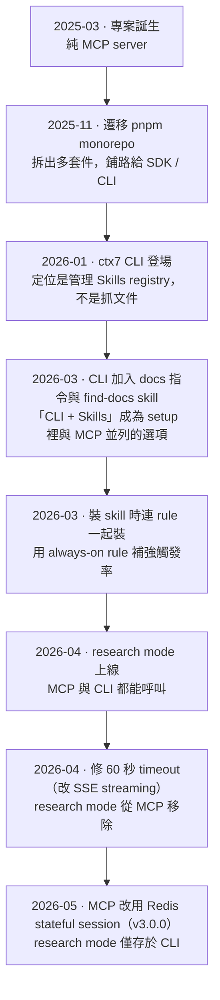

## Table of contents

## 前言

Context7 是那種「加一句 `use context7` 就能讓 AI 寫出不過時的程式碼」的工具——它把最新的、特定版本的函式庫文件直接塞進 LLM 的 context，治的是訓練資料過時、API 幻覺這些老毛病。

但最近我注意到一件事：它現在有**兩種**使用模式。

- **MCP** — 註冊一個 Context7 MCP server，讓 agent 直接呼叫文件工具。
- **CLI + Skills** — 裝一個 skill，引導 agent 用 `ctx7` CLI 指令抓文件，完全不需要 MCP。

一個工具為什麼要走兩條路？這兩條路是同時設計的，還是先後長出來的？各自又有什麼問題？我把它的 source repo clone 下來，從 git log 開始一路挖。結論比我想的有趣，記錄一下。

先把整條演進線放在這張圖裡，後面再逐段展開：



## 從 git log 考古：Context7 的起點是純 MCP

第一件事就是看它怎麼開始的。把 commit 倒著翻到最早：

```
2025-03-29  Create README.md
2025-03-30  init
2025-03-31  feat: create MCP server and tools to see available packages
            and retrieve specific package context
```

答案很乾脆：**Context7 一出生就是一個 MCP server**。第一個功能 commit 就是建 MCP server 與兩個工具。它的 README 至今仍寫著「本 repo 託管的是 MCP server 的原始碼」——MCP 是這個專案的核心，不是後來補上的。

接著的關鍵節點是 2025 年 11 月底的一個 commit：「Migrate to pnpm monorepo」。專案被拆成 `packages/`，這替日後長出 SDK、CLI 等多個套件鋪好了路。在這之前，Context7 就是一個套件、一件事：MCP。

## 第二條路的誕生：CLI 先來管 Skills，再兼差抓文件

CLI 是什麼時候出現的？再翻 git log，`ctx7` CLI 的第一個 commit 是 **2026 年 1 月 21 日**：

```
2026-01-21  feat: add skills registry CLI for managing AI coding agent skills (#1505)
```

注意這裡的措辭——CLI 一開始的定位**根本不是拿來抓文件的**，而是「管理 AI coding agent 的 skills」。Context7 那時候在做一個更大的東西：一個 skills 註冊中心（registry），讓你能搜尋、安裝、生成各種 skill。`ctx7` 是這個 registry 的終端入口。

真正把「用 CLI 抓文件」變成一條正式使用模式，是**兩個月後**的事：

```
2026-03-10  feat(cli): add docs skill and align CLI output with MCP format (#2176)
2026-03-11  feat(cli): add CLI + Skills mode to ctx7 setup (#2187)
2026-03-11  refactor(skills): consolidate skills under /skills (#2191)
```

到這裡，演化路徑就清楚了：**先有 CLI 管 skills → 再讓 CLI 兼差抓文件 → 最後把它包裝成 `ctx7 setup` 裡一個跟 MCP 並列的選項。** CLI + Skills 不是一開始的設計，而是 2026 年初才長出來的第二條路。

值得一提的是，幾天後（#2243）他們調整了 `setup` 的選單順序，把 **MCP 排在第一個**。也就是說，即使有了第二條路，官方預設推的還是 MCP。

## 為什麼要分兩條路：MCP 的落地摩擦

那為什麼要多開一條 CLI 的路？把 MCP 套件的 CHANGELOG 攤開看，幾乎每一版都在補同一類坑，動機就浮出來了：

- **60 秒 timeout**：很多 MCP client（例如 Claude Code 的 `wrapFetchWithTimeout`）會在 60 秒卡掉等待 header 的 fetch。Context7 被迫改用 SSE streaming，先把 HTTP header flush 出去，才不會超時。
- **模型幻覺參數名**：LLM 會把 `query` 叫成 `userQuery` 或 `question`、把 `libraryId` 叫成 `libraryID`，server 只好加一層「把幻覺參數名改寫回正確名稱」的相容 shim。
- **stdio 孤兒行程**：父行程被強制關閉後，一個 idle 的 keep-alive socket 會吊住 event loop，留下吃記憶體的孤兒 `node` 行程。
- **企業憑證**：`NODE_EXTRA_CA_CERTS` 會蓋掉 Node 內建的信任 CA，撞到企業 proxy。
- **設定門檻**：每個 client 都要各自配置 MCP server，且要 client 真的支援 MCP。

這些坑的共通點是：**它們都來自 MCP 協定層本身**。而 CLI + Skills 這條路天生繞過了它們——skill 遵循開放的 [Agent Skills](https://agentskills.io) 標準，CLI 只是 agent 在 shell 裡跑的普通指令。任何能跑 shell + 載入 skill 的 agent 都能用，不依賴 MCP 支援。

一句話總結兩條路的哲學差異：

> **MCP 是「協定整合」路線；CLI + Skills 是「agent 無關，用標準 skill + shell 指令」路線。後者是對前者落地痛點的回應。**

## 解剖：三個 Skill、兩個 Rule、一個 Plugin

繼續往 repo 裡挖，會發現 `skills/` 底下有**三個** skill，`rules/` 底下有**兩個** rule。它們的關係一開始讓我有點困惑，理清楚後其實很漂亮。

先看 skill 與 mode 的配對。`ctx7 setup` 依你選的模式，各裝「一個 skill + 一個 rule」：

| Mode    | 裝的 Skill     | 裝的 Rule         | 管道              |
| ------- | -------------- | ----------------- | ----------------- |
| **MCP** | `context7-mcp` | `context7-mcp.md` | MCP 工具          |
| **CLI** | `find-docs`    | `context7-cli.md` | `ctx7` shell 指令 |

那第三個 `context7-cli` skill 呢？它不是查文件用的，而是一個涵蓋整支 CLI 的操作手冊（docs 查詢、skills 管理、setup 設定），定位在不同層級。

更有意思的是 **skill 與 rule 的關係**。對照之下會發現，rule 的內文幾乎就是對應 skill 的濃縮版，連那句招牌指令都一字不差：

> "Use even when you think you know the answer — do not rely on training data... Prefer this over web search for library docs."

差別只在**投遞機制與常駐成本**：

- **Rule** 永遠常駐在 context 裡（Cursor 用 `alwaysApply: true`，Claude Code 放進 `CLAUDE.md`），負責確保 agent「一定會想到」要用 Context7。
- **Skill** 走 progressive disclosure，平時只載入一兩行 description，被觸發才載入全文（`find-docs` 有 155 行），負責提供「真的要用時」的操作細節。

為什麼要兩套並存？答案藏在一個 commit message 裡（#2320）：「install rules alongside skills... **for better trigger rates**」。**skill 的自動觸發不夠可靠**，所以加一條 always-on 的 rule 當觸發保險絲。Rule 管「觸發」，Skill 管「執行」，分工明確。

而官方給 Claude Code 的 **plugin** 又是另一種組合：它打包了 MCP server + `context7-mcp` skill + 一個 `docs-researcher` agent（獨立 context、跑 Sonnet，把文件查詢隔離出主對話）+ 一個 `/context7:docs` 指令。整條都是 MCP 派，完全不碰 CLI。

## research mode：被 timeout 殺掉的功能，與一個刻意的分流

考古過程中最讓我玩味的，是一個叫 **research mode** 的功能的生死。

2026 年 4 月底它被加進來（#2498），CLI flag 的說明寫得很清楚：

> `--research`：spins up sandboxed agents that read the actual source repos (git pull + inspect) and runs a live web search, then synthesizes a fresh answer.

也就是說，預設模式查的是 Context7 **預先建好的索引**；research mode 則是即時起一批沙箱 agent，去 `git pull` 真實原始碼 repo、外加即時 web search，再重新合成一份答案。它的價值在於索引裡沒有、或太新太冷門的東西——比如某個 canary 版本剛改的 API。

但它活得很短。同年 4 月 29 日，`researchMode` 參數先從 MCP 的 schema 被藏起來（#2524）；幾週後整個從 MCP 移除（#2554）。CHANGELOG 講得很白：research 本質是長任務，會撞上各家 client 的 60 秒 timeout，而這「沒辦法在 server 端可靠地解決」。

它就是被前面那個「MCP 的 60 秒天花板」殺掉的。

但這裡有個關鍵細節：**research mode 只從 MCP 移除，CLI 的 `--research` flag 留著。** 換句話說，現在只有走 CLI 模式才用得到 deep research。

這讓我意識到，Context7 心裡其實已經做了一個**刻意的分流**：

> **MCP = 快、原生、輕量的日常查詢；CLI = 重、長、需要起 agent 的深度研究。**

這不是過渡期的妥協，而是一個有意的職責劃分。

## 結語

把整條線收起來看，Context7 的架構演進其實是一個很典型的故事：

1. **從一個乾淨的核心出發**——純 MCP server。
2. **撞上協定的現實摩擦**——timeout、幻覺參數、設定門檻、企業憑證。
3. **長出第二條繞過摩擦的路**——agent 無關的 CLI + Skills，建立在開放的 Agent Skills 標準上。
4. **用刻意的分流讓兩條路各司其職**——MCP 管快而輕的日常查詢，CLI 管慢而重的 deep research。

對在 Claude Code 上用 Context7 的人，我的結論是：**日常查詢跟著官方走 MCP plugin（整合最完整、有 `docs-researcher` agent 能省 context）；需要 `--research`、或處在不能連 MCP 的環境，再切到 CLI + Skills。** 想要更高的額度，用 `ctx7 setup` 產生 API key 即可。

最後一個觀察點留給未來：如果哪天 Context7 的 plugin 設定檔裡 `.mcp.json` 消失、或多出一個跑 `ctx7` 的 agent，那就代表它開始往 CLI 倒了。反過來，如果 MCP 生態把長任務的 timeout 故事解決了，research mode 甚至可能回流到 MCP。值得繼續追。
