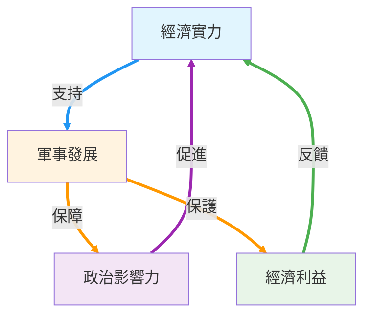

# 引言

在當代國際關係和國家治理理論中，經濟、政治與軍事三者之間的關係始終是學者們探討的核心議題。從古典軍事思想到現代政治經濟學，從歷史經驗到當代實踐，這三個國家權力要素之間展現出複雜而緊密的相互依存關係。本文將探討這一循環動力學的理論基礎、歷史演進與現實意義，並提出「經濟為政治之基石，軍事乃政治之延伸，經濟利益的安全發展仰賴軍事保護」的核心論述。

# 理論基礎與學術淵源

## 古典軍事思想的政治導向

早在兩千多年前，中國古代軍事思想家[孫武](https://zh.wikipedia.org/zh-tw/%E5%AD%99%E6%AD%A6)在《[孫子兵法](https://zh.wikipedia.org/zh-tw/%E5%AD%99%E5%AD%90%E5%85%B5%E6%B3%95)》中便確立了政治在軍事決策中的主導地位。孫子強調

> 兵者，國之大事，死生之地，存亡之道，不可不察也

將**政治合法性**和**民心向背**視為軍事勝利的首要條件。其「**全勝**」思想更是主張**通過政治手段達到軍事目標**，體現了政治智慧在軍事運用中的重要性。

普魯士軍事理論家[卡爾·馮·克勞塞維茨](https://zh.wikipedia.org/zh-tw/%E5%8D%A1%E5%B0%94%C2%B7%E5%86%AF%C2%B7%E5%85%8B%E5%8A%B3%E5%A1%9E%E7%BB%B4%E8%8C%A8)在《[戰爭論](https://zh.wikipedia.org/zh-tw/%E6%88%98%E4%BA%89%E8%AE%BA)》中提出了影響深遠的觀點：

> 戰爭是政治通過另一種手段的延續。

克勞塞維茨認為**政治目的決定戰爭性質**，**軍事行動必須服從政治目標**，**政治考慮應該指導軍事決策**。這一論述確立了軍事作為政治工具的根本定位，為後世軍事思想奠定了理論基礎。

## 政治經濟學的經濟決定論

在政治經濟學領域，[卡爾·馬克思](https://zh.wikipedia.org/zh-tw/%E5%8D%A1%E5%B0%94%C2%B7%E9%A9%AC%E5%85%8B%E6%80%9D)的歷史唯物主義直接提出「經濟基礎決定上層建築」的命題，認為**經濟關係是政治制度變遷的根本動力**。這一觀點強調了經濟在政治發展中的基礎性作用，為理解經濟如何影響政治提供了重要的理論框架。

[亞當·斯密](https://zh.wikipedia.org/zh-tw/%E4%BA%9A%E5%BD%93%C2%B7%E6%96%AF%E5%AF%86)在《[國富論](https://zh.wikipedia.org/zh-tw/%E5%9C%8B%E5%AF%8C%E8%AB%96)》中也探討了經濟利益如何影響政治制度和政策制定過程，認為商業利益集團會對政府決策產生重要影響。這些古典政治經濟學觀點為現代民主理論中的經濟投票理論提供了思想源泉。

## 現代政治學的經濟投票理論

現代政治學研究進一步證實了經濟對政治的決定性影響。美國政治學家 [V.O. Key](https://en.wikipedia.org/wiki/V._O._Key_Jr.) 在 1960 年代提出的「經濟投票理論」認為，選民會根據經濟表現來獎懲在任政府。[Morris Fiorina](https://en.wikipedia.org/wiki/Morris_Fiorina) 發展的「回顧性投票」概念更是明確指出，選民主要根據過去的經濟表現來進行投票決策。

實證研究也提供了強有力的支持。[阿爾貝托·阿萊西納](https://zh.wikipedia.org/zh-tw/%E9%98%BF%E5%B0%94%E8%B4%9D%E6%89%98%C2%B7%E9%98%BF%E8%8E%B1%E8%A5%BF%E9%82%A3)等經濟學家的研究證實，經濟衰退通常導致在任政府失去選舉，GDP 增長率與執政黨得票率呈現明顯的正相關關係。[道格拉斯·希伯斯](https://scholar.google.com/citations?user=tbPsBqcAAAAJ&hl=en)的研究更是顯示，美國總統選舉結果與選前兩年的經濟表現高度相關，印證了[詹姆斯·卡維爾](https://en.wikipedia.org/wiki/James_Carville)那句著名的競選口號：「[笨蛋，問題是經濟！](https://en.wikipedia.org/wiki/It%27s_the_economy,_stupid)」

# 歷史經驗與現實案例

## 民主政體中的經濟政治循環

在民主政體中，經濟表現對政治走向的影響尤為明顯。[英國 1992 年的「黑色星期三」匯率危機](https://zh.wikipedia.org/zh-tw/%E9%BB%91%E8%89%B2%E6%98%9F%E6%9C%9F%E4%B8%89)直接導致保守黨支持率暴跌，最終在 1997 年大選中失利，成為經濟危機改變政治格局的典型案例。德國 2005 年施羅德政府因高失業率在大選中敗給梅克爾，日本 1990 年代經濟泡沫破裂後自民黨長期執政地位受到挑戰，這些都證明了經濟表現在民主政治中的關鍵作用。

經濟影響政治的機制主要通過三個途徑實現：選舉問責機制使選民用選票獎懲政府的經濟表現，經濟利益變化導致政治聯盟重新組合，經濟問題決定政治議程的優先順序。這些機制確保了民主政體中經濟表現與政治穩定之間的密切聯繫。

## 海權時代的軍事經濟保護

歷史上海權時代的發展為軍事保護經濟利益提供了豐富的案例。19 至 20 世紀初的英國皇家海軍通過維護全球航線，保護英國的海外貿易和殖民地經濟，使英國成為「日不落帝國」。17 世紀的[荷蘭東印度公司](https://zh.wikipedia.org/zh-tw/%E8%8D%B7%E5%85%B0%E4%B8%9C%E5%8D%B0%E5%BA%A6%E5%85%AC%E5%8F%B8)依靠強大海軍力量保護香料貿易路線，確保了荷蘭在全球貿易中的主導地位。

二戰後的美國海軍接過了維護全球海上通道的責任，支撐美元體系和國際貿易的正常運作。美國第七艦隊保護亞太航線，各國在索馬利亞海域的護航行動，以及在南海、麻六甲海峽等戰略要道的軍事存在，都體現了軍事力量在保護經濟利益中的關鍵作用。

這些歷史經驗表明，強大的海軍不僅是政治力量的延伸，更是保護國際貿易這個「公共財」的關鍵力量。沒有軍事力量的保護，全球經濟的自由流動就會面臨威脅，而經濟利益受損又會反過來影響政治穩定。

# 現實主義國際關係理論的貢獻

[約翰·米爾斯海默](https://zh.wikipedia.org/zh-tw/%E7%B4%84%E7%BF%B0%C2%B7%E7%B1%B3%E7%88%BE%E6%96%AF%E6%B5%B7%E9%BB%98)的[攻勢現實主義](https://zh.wikipedia.org/zh-tw/%E6%94%BB%E5%8B%A2%E7%8F%BE%E5%AF%A6%E4%B8%BB%E7%BE%A9)理論為理解經濟、政治和軍事的循環關係提供了重要視角。在《[大國政治的悲劇](https://zh.wikipedia.org/zh-tw/%E5%A4%A7%E5%9B%BD%E6%94%BF%E6%B2%BB%E7%9A%84%E6%82%B2%E5%89%A7)》中，米爾斯海默強調**經濟力量是軍事力量的基礎**，**國家需要經濟實力來建設和維持強大的軍事力量**。同時，**政治決策和戰略直接影響軍事發展方向和資源分配**，而**軍事力量則保障國家安全和經濟利益，為經濟發展創造有利條件**。

米爾斯海默特別關注「潛在力量」概念，主要體現為**人口**和**財富**，這些最終能轉化為軍事能力。他認為國家始終追求最大化相對權力，而這種追求構成了一個不斷循環的過程：**經濟實力支持軍事發展**，**軍事實力保障政治影響力和經濟利益**，**政治影響力又促進了經濟發展**。

[保羅·甘迺迪](https://zh.wikipedia.org/zh-tw/%E4%BF%9D%E7%BD%97%C2%B7%E8%82%AF%E5%B0%BC%E8%BF%AA_(%E5%8E%86%E5%8F%B2%E5%AD%A6%E5%AE%B6))在《[霸權興衰史：1500至2000年的經濟變遷與軍事衝突(The Rise and Fall of the Great Powers: Economic Change and Military Conflict From 1500 to 2000)](https://en.wikipedia.org/wiki/The_Rise_and_Fall_of_the_Great_Powers)》中也探討了經濟實力與軍事力量之間的關係，以及它們如何影響國家的政治地位。這些現實主義理論家的觀點為理解國家權力的循環動力學提供了重要的理論支撐。

# 循環動力學的核心機制

## 經濟為政治之基石

經濟在政治發展中的基礎性作用體現在多個層面。在民主政體中，**經濟表現直接影響選民的投票行為，決定政府的政治命運**。經濟增長提供了政治穩定的物質基礎，而經濟衰退則往往伴隨著政治動盪和政府更迭。

**經濟實力也決定了國家在國際政治中的地位和影響力**。經濟強國往往能夠在國際組織中發揮更大作用，在國際談判中佔據更有利地位，並通過經濟手段實現政治目標。**經濟制裁**、**貿易優惠**、**投資協議**等經濟工具已成為現代外交的重要組成部分。

## 軍事乃政治之延伸

軍事力量作為政治意志的實現工具，承載著政治目標的實現功能。從克勞塞維茨的戰爭理論到孫子的軍事思想，都強調軍事行動必須服從政治目標，體現政治意圖。

在當代國際關係中，軍事力量不僅體現在實際的軍事衝突中，更多地表現為**威懾力量**和**談判籌碼**。軍事實力的強弱直接影響國家在國際談判中的地位，影響其他國家對該國政治意圖的認知和回應。

軍事力量的部署和使用也反映了政治決策的優先順序和戰略考量。**軍費開支的分配**、**軍事基地的設置**、**軍事演習的安排**，都體現了政治領導層的戰略思維和政治目標。

## 經濟利益的安全發展仰賴軍事保護

軍事力量對經濟發展的保護作用是循環動力學的重要環節。軍事安全為經濟活動提供了穩定的環境，保護了**貿易路線**、**資源開採**、**投資環境**等經濟利益的實現條件。

海權時代的歷史經驗清楚地展示了這一關係。從荷蘭東印度公司到英國皇家海軍，再到現代美國海軍，海上軍事力量始終是保護國際貿易和經濟利益的關鍵因素。當代的索馬利亞護航、南海航行自由等問題，都體現了軍事保護對經濟發展的重要意義。

軍事保護不僅體現在對外防禦上，也包括**維護國內秩序**、**保護產權**、**確保基礎設施安全**等方面。沒有軍事力量的保障，經濟活動就會面臨各種安全威脅，影響投資信心和經濟發展。

# 當代意義與未來展望

## 全球化背景下的循環動力學

在全球化時代，經濟、政治和軍事的循環關係變得更加複雜和緊密。全球產業鏈的形成使得經濟安全問題具有了更強的國際性，任何一個環節的軍事威脅都可能影響全球經濟穩定。

網路安全、太空安全等新興安全領域的出現，擴展了軍事保護的範圍和內容。經濟數位化使得網絡攻擊可能造成巨大經濟損失，太空基礎設施的安全直接關係到現代經濟活動的正常運作。

## 新興大國的挑戰與機遇

對於新興大國而言，理解和運用經濟、政治、軍事的循環動力學具有重要的戰略意義。如何通過經濟發展提升政治影響力，如何通過軍事能力保護經濟利益，如何在國際體系中實現三者的良性循環，都是新興大國面臨的重要課題。

中國的「[一帶一路](https://zh.wikipedia.org/zh-tw/%E4%B8%80%E5%B8%A6%E4%B8%80%E8%B7%AF)」倡議就體現了這種循環思維的運用：通過經濟合作提升政治影響力，通過政治協調推進經濟項目，同時考慮相關地區的安全穩定因素。

### 「一帶一路」戰略中的港口與交通要道布局

中國在「一帶一路」框架下的港口和交通基礎設施投資，清楚地展現了經濟投資、政治影響力和潛在軍事利益的結合。這些項目體現了前述循環動力學在當代地緣政治中的具體應用：

* 重要港口項目：
    * [巴基斯坦](https://zh.wikipedia.org/zh-tw/%E5%B7%B4%E5%9F%BA%E6%96%AF%E5%9D%A6)[瓜達爾港](https://zh.wikipedia.org/zh-tw/%E7%93%9C%E8%BE%BE%E5%B0%94%E6%B8%AF)：作為「[中巴經濟走廊](https://zh.wikipedia.org/zh-tw/%E4%B8%AD%E5%B7%B4%E7%B6%93%E6%BF%9F%E8%B5%B0%E5%BB%8A)」的關鍵節點，中國投資約 460 億美元發展該港口。瓜達爾港不僅為中國提供了通往[印度洋](https://zh.wikipedia.org/zh-tw/%E5%8D%B0%E5%BA%A6%E6%B4%8B)的戰略通道，也展現了經濟投資如何轉化為地緣政治影響力。該港口的戰略位置使其具備潛在的軍事價值，能夠監控[荷姆茲海峽](https://zh.wikipedia.org/zh-tw/%E9%9C%8D%E7%88%BE%E6%9C%A8%E8%8C%B2%E6%B5%B7%E5%B3%BD)的重要航道。
    * [斯里蘭卡](https://zh.wikipedia.org/zh-tw/%E6%96%AF%E9%87%8C%E8%98%AD%E5%8D%A1)[漢班托塔港](https://zh.wikipedia.org/zh-tw/%E6%BC%A2%E7%8F%AD%E6%89%98%E5%A1%94%E6%B8%AF)：[中國港灣工程公司](https://zh.wikipedia.org/zh-tw/%E4%B8%AD%E5%9B%BD%E6%B8%AF%E6%B9%BE)投資建設的深水港，由於斯里蘭卡無力償還貸款，最終以 99 年租約的形式交由中國管理。這個案例展示了經濟投資如何轉化為長期的戰略控制權，該港口位於印度洋主要航線上，具有重要的地緣戰略意義。
    * [希臘](https://zh.wikipedia.org/zh-tw/%E5%B8%8C%E8%85%8A)[比雷埃夫斯港](https://zh.wikipedia.org/zh-tw/%E6%AF%94%E9%9B%B7%E5%9F%83%E5%A4%AB%E6%96%AF%E6%B8%AF)：[中國遠洋海運集團(COSCO)](https://zh.wikipedia.org/zh-tw/%E4%B8%AD%E5%9B%BD%E8%BF%9C%E6%B4%8B%E6%B5%B7%E8%BF%90%E9%9B%86%E5%9B%A2)控股該港口，使其成為中國商品進入歐洲的重要門戶。通過經濟投資，中國不僅獲得了商業利益，也在歐洲獲得了重要的政治影響力支點。
    * [吉布地](https://zh.wikipedia.org/zh-tw/%E5%90%89%E5%B8%83%E6%8F%90)[多哈雷港口](https://en.wikipedia.org/wiki/Port_of_Doraleh)：位於[紅海](https://zh.wikipedia.org/zh-tw/%E7%BA%A2%E6%B5%B7)戰略要衝，中國通過投資港口建設，同時在附近建立了首個海外軍事基地。這直接體現了經濟投資與軍事部署的結合，展現了保護經濟利益與擴展軍事影響力的雙重目標。

* 交通要道控制：
    * [中歐班列](https://zh.wikipedia.org/zh-tw/%E4%B8%AD%E6%AD%90%E7%8F%AD%E5%88%97)鐵路網：通過投資中亞地區的鐵路基礎設施，中國建立了連接歐亞大陸的陸路貿易通道，減少了對傳統海上航線的依賴，同時增強了在中亞地區的政治影響力。
    * [中緬經濟走廊](https://zh.wikipedia.org/zh-tw/%E4%B8%AD%E7%BC%85%E7%BB%8F%E6%B5%8E%E8%B5%B0%E5%BB%8A)：包括中緬鐵路和公路項目，為中國提供了繞過[麻六甲海峽](https://zh.wikipedia.org/zh-tw/%E9%A9%AC%E5%85%AD%E7%94%B2%E6%B5%B7%E5%B3%A1)的替代通道，同時加強了與[緬甸](https://zh.wikipedia.org/zh-tw/%E7%BC%85%E7%94%B8)的政治經濟聯繫。

#### 戰略意義分析：

這些基礎設施投資體現了「經濟為政治之基石，軍事乃政治之延伸，經濟利益的安全發展仰賴軍事保護」循環邏輯的現實應用：
    * 經濟投資建立政治影響力：通過大規模基礎設施投資，中國在相關國家建立了深度的經濟依賴關係，進而轉化為政治影響力。
    * 政治影響力支持軍事存在：在獲得政治影響力的基礎上，中國能夠在戰略要地建立軍事存在，如吉布地基地的建立。
    * 軍事存在保護經濟利益：軍事力量的部署為中國的海外經濟投資和貿易路線提供了安全保障，形成了完整的戰略循環。

這種戰略布局不僅服務於中國的經濟發展需要，也重塑了印度洋和歐亞大陸的地緣政治格局，展現了 21 世紀大國競爭中經濟、政治、軍事要素整合運用的新特點。

### 尼日案例：中國軍事保護能力的局限性

2023 年[尼日](https://zh.wikipedia.org/zh-tw/%E5%B0%BC%E6%97%A5%E5%B0%94)軍事政變及其後續發展，為中國在海外經濟利益保護方面提供了一個重要的反面案例，凸顯了當軍事保護能力不足時，經濟投資面臨的風險。

#### 政變前的中國投資規模：

中國是尼日第二大外國投資者，僅次於前殖民國法國。中國對尼日的外國直接投資總額截至 2020 年底達到 26.8 億美元，主要集中在石油和鈾礦開採領域。[中國石油天然氣集團公司（CNPC）](https://zh.wikipedia.org/zh-tw/%E4%B8%AD%E5%9B%BD%E7%9F%B3%E6%B2%B9%E5%A4%A9%E7%84%B6%E6%B0%94%E9%9B%86%E5%9B%A2)自 2008 年與尼日政府簽署生產分享協議，開發阿加德姆油田，該油田估計儲量為 6.5 億桶。中國國家石油公司投資約 45 億美元建設從尼日東部到貝南海岸的石油管道，這條管道自 2024 年初開始運營，每日輸送約 9 萬桶石油。

#### 政變後的逐步驅逐：

2023 年 7 月軍事政變後，尼日與西方國家關係惡化，新軍政府驅逐了對抗伊斯蘭叛亂的法國維和部隊，並要求美國撤離兩個無人機基地。然而，即使中國在政變期間保持中立立場，避免發表任何「爭議性」聲明，拒絕承認事件為「政變」，中國的經濟利益仍然受到衝擊。

* 三月高管驅逐事件：
    2025 年 3 月，尼日軍政府因薪酬差距爭議驅逐了三名中國石油高管，他們分別來自中國石油天然氣集團公司（CNPC）、西非石油管道公司（WAPCo）和 SORAZ 煉油廠。石油部長薩哈比·烏馬魯指出了嚴重的薪酬差距，中國員工平均月薪為 8,678 美元，而尼日員工的同等職位僅為 1,200 美元。

* 五月員工全面撤離要求：
    2025 年 5 月，情況進一步惡化。尼日要求一些在石油項目工作的中國員工離開該國，石油部長薩哈比·烏馬魯要求中國石油天然氣集團公司（CNPC）及其煉油廠 SORAZ 終止在尼日工作超過四年的外籍員工合同。如果這一決定得到執行，數十名中國工人將不得不回國。

#### 中國軍事保護能力的不足：

這一系列事件清楚地展現了中國軍事實力尚未成熟到足以保護其海外投資和債權的現實：
    * 缺乏軍事威慑力量：與美國和法國不同，中國在西非沒有實質性的軍事存在能夠保護其經濟利益。雖然美國和法國軍事力量的撤出為中國擴大其軍事影響力創造了機會，但中國尚未建立起相應的軍事保護能力。
    * 外交調解的局限性：儘管中國外交部發言人表示中國始終堅持真實、友好、誠懇以及正確的義利觀原則與非洲開展合作，但僅靠外交手段無法阻止經濟利益受損。
    * 投資回報風險：中國已在尼日石油工業投資數十億美元，現在必須解決政治爭端，否則將看不到任何資金回報。這種情況說明了經濟投資在缺乏軍事保護的情況下面臨的脆弱性。

#### 循環動力學的失衡：

尼日案例完美地展示了當「經濟利益的安全發展仰賴軍事保護」這一環節出現問題時，整個循環動力學如何受到衝擊。中國雖然通過經濟投資在尼日建立了重要地位，但由於缺乏相應的軍事保護能力，當政治環境發生變化時，這些經濟利益變得極其脆弱。這種情況與歷史上海權國家能夠通過軍事力量保護貿易路線和海外投資形成了鮮明對比，揭示了中國在全球力量投射能力方面仍存在的差距。

這種綜合性的戰略思維反映了對經濟、政治、軍事循環關係的深刻理解和實際運用。

# 結論

> 經濟為政治之基石，軍事乃政治之延伸，經濟利益的安全發展仰賴軍事保護。

這一論述揭示了國家權力運作的核心機制。從古典軍事思想到現代政治經濟學理論，從歷史經驗到當代實踐，都證明了經濟、政治、軍事三者之間存在著密不可分的循環依存關係。

這一循環動力學不僅是理論思辨的結果，更是歷史經驗的總結和現實需要的反映。在日益複雜的國際環境中，準確理解和有效運用這一循環關係，對於國家的長期發展和國際地位的提升具有重要的戰略意義。

未來的國際競爭將更加體現為這三個要素的綜合較量。能夠在經濟、政治、軍事之間實現良性循環的國家，將在國際體系中佔據更加有利的地位，為本國發展和世界和平作出更大貢獻。
