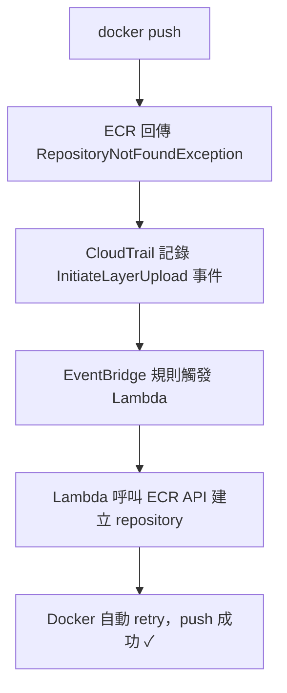
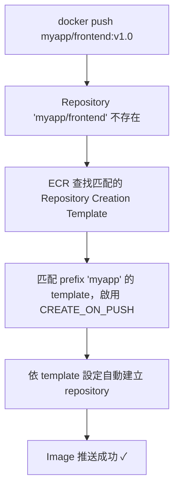

## Table of contents

## 問題根源

[ECR](https://aws.amazon.com/ecr/)（Amazon Elastic Container Registry）從設計之初就有個讓工程師抓狂的限制：

> **推送 image 之前，必須先手動建立 repository。**

這和所有主流 container registry 的行為完全相反。[Docker Hub](https://hub.docker.com/)、[GCR](https://cloud.google.com/artifact-registry)、[ACR](https://azure.microsoft.com/products/container-registry)、[Quay](https://quay.io/)、[Harbor](https://goharbor.io/)、[Artifactory](https://jfrog.com/artifactory/)——每一家的邏輯都是 **「不用管 repository 在不在，不在的話推了就會自動建立」**。ECR 是業界的異類。

實際開發上這很煩：

- CI/CD pipeline 新增 microservice，就得先去建 repository
- 沒有足夠 IAM 權限的話，還得找基礎建設團隊協助
- 每個人的 pipeline 裡都塞滿了這樣的 workaround 腳本：

```bash
# 天下工程師都在寫這段
aws ecr describe-repositories --repository-names "$REPO" 2>/dev/null || \
  aws ecr create-repository --repository-name "$REPO"
docker push "$IMAGE"
```

---

## Issue #853 的誕生（2020 年 4 月）

2020 年 4 月，GitHub 用戶 `rpnguyen` 在 [AWS containers roadmap](https://github.com/aws/containers-roadmap) 提出了這個需求，訴求非常直白：

> _「推送 image 時，如果 repository 不存在，請自動建立它。」_

Issue 標籤被設為 **Work in Progress**，然後……就沒有然後了。

這個 issue 最終累積了：

- **700+ 個 👍**
- **79 個 ❤️**

社群留言大概長這樣：

> _「這是我們遷移到 ECR 的最大障礙，難以置信竟然還沒有這個功能。」_（2022 年 7 月）

> _「我們真的需要這個功能，否則根本沒辦法使用 ECR。」_（2022 年 10 月）

---

## 漫長等待與 Workaround 年代（2020–2024）

在 AWS 遲遲不動作的這幾年，工程師們發展出各種民間解法。其中最流行的是一套「CloudTrail + EventBridge + Lambda 組合拳」：



這個架構要串接四個 AWS 服務，外加 Terraform 模組管理 IAM Role、Lambda 函數、EventBridge Rule。只為了完成一個 `docker push`。

### AWS 的神奇操作

2024 年 10 月，AWS 在官方部落格發了一篇文章 [Dynamically create repositories upon image push to Amazon ECR](https://aws.amazon.com/blogs/containers/dynamically-create-repositories-upon-image-push-to-amazon-ecr/)，手把手教大家怎麼搭上述 workaround 架構。

很微妙吧？知道是痛點，但選擇「教你繞過去」而不是「直接修掉」。社群的反應大致是：

> 謝謝你教我怎麼用四個服務解決一個本來不該存在的問題。

---

## 終於 Shipped（2025 年 12 月 19 日）

距離 issue 提出整整 **五年八個月** 後，AWS 正式發布 ECR 原生支援 [**Create on Push**](https://aws.amazon.com/about-aws/whats-new/2025/12/amazon-ecr-repository-creation-templates-create-on-push/)。

### 功能運作方式

做法是先建好 [Repository Creation Template](https://docs.aws.amazon.com/AmazonECR/latest/userguide/repository-creation-templates.html)，定義 repository 的預設設定。之後 push 到不存在的 repo 時，ECR 就會自動套用 template 建立：



### Terraform 設定範例

```hcl
# https://registry.terraform.io/providers/hashicorp/aws/latest/docs/resources/ecr_repository_creation_template
resource "aws_ecr_repository_creation_template" "example" {
  prefix      = "myapp"
  description = "Auto-create repos for myapp services"

  applied_for = [
    "CREATE_ON_PUSH",
  ]

  image_tag_mutability = "IMMUTABLE"

  encryption_configuration {
    encryption_type = "AES256"
  }
}
```

功能已在所有 AWS 商業區域與 GovCloud (US) 上線。

---

## 時間軸總結

| 時間                | 事件                                                 |
| ------------------- | ---------------------------------------------------- |
| 2020 年 4 月        | Issue #853 提出，標記為 Work in Progress             |
| 2020–2022           | 社群各自摸索 workaround，留言越積越多                |
| 2022 年下半年       | 留言出現「這是最大障礙」、「無法使用 ECR」等強烈反應 |
| 2024 年 10 月       | AWS 官方發文教大家「怎麼用 Lambda workaround」       |
| 2025 年 12 月 19 日 | AWS 正式 ship 原生 Create on Push，issue 關閉        |

其他 registry 生來就有的功能，ECR 讓全世界工程師等了將近六年才補上。就這樣。
