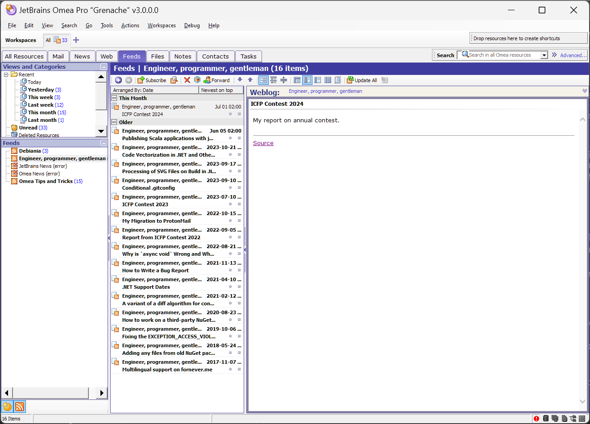

2004 年，[JetBrains](https://www.jetbrains.com/) 推出了一套叫 Omea 的桌面軟體，想把郵件、RSS、即時通訊、書籤和本機文件收進同一個資料庫，用型別化的連結串起來，再統一索引搜尋。它在 2008 年停止開發、以 GPL v2 開源，之後幾乎被遺忘。我讀了它的原始碼，發現這套設計和這幾年 AI 圈在做的 RAG、GraphRAG、connector、MCP 處理的是同一組問題。它當年沒做起來，很大一部分是因為整理資訊的工作全落在使用者身上，而這件事現在可以交給 LLM。

## Table of contents

## 翻 JetBrains 公司史時撞見的產品

JetBrains 對大多數工程師來說就是 IDE 公司。IntelliJ IDEA、PyCharm、Rider、Kotlin，這些名字幾乎是軟體開發日常的一部分。

最近我在查 JetBrains 的公司歷史。這家公司 2000 年由三位俄羅斯工程師 Sergey Dmitriev、Valentin Kipyatkov 與 Eugene Belyaev 在布拉格創立，最早的產品是 Java 重構工具 IntelliJ Renamer，之後才有 IntelliJ IDEA（見[維基百科](https://en.wikipedia.org/wiki/JetBrains)）。我想弄清楚它怎麼從一個 Java 工具走到今天的產品線，翻到 2004 年的新聞稿時，看到一個完全沒聽過的產品名字：**Omea**。

那篇[新聞稿](https://blog.jetbrains.com/blog/2004/10/04/pr_041004/)說，這是 JetBrains「第一個面向一般消費者的產品」。一家做開發者工具的公司，在 IntelliJ IDEA 4.5 發表後三個月，跑去做了一套 Windows 上的 RSS 閱讀器？再往下查，事情比 RSS 閱讀器有意思得多。Omea 有一個 Pro 版本，官方稱它為「整合資訊環境」（Integrated Information Environment）。它在 2008 年停止開發，JetBrains 把原始碼以 GPL v2 開源。十六年後，有位開發者把這份幾乎消失的原始碼從 SVN 搬上 GitHub，讓它重新能在 Windows 11 上跑起來。

讀完 Omea Pro 的功能說明，我第一個反應是：這不就是這幾年 AI 浪潮裡大家在做的東西嗎？

它想把郵件、RSS、即時通訊、瀏覽器書籤、本機文件全部收進同一個容器，統一索引、跨類型搜尋。它讓使用者在不同資訊之間建立連結，用「工作區」切換脈絡，用規則自動分類，把網頁片段剪下來並保留來源。

過去幾年，從 [Obsidian](https://obsidian.md/)、[Logseq](https://logseq.com/) 帶起的雙向連結與[個人知識管理](https://en.wikipedia.org/wiki/Personal_knowledge_management)（PKM）熱潮，到 LLM 出現後的 [RAG](https://en.wikipedia.org/wiki/Retrieval-augmented_generation)、[GraphRAG](https://microsoft.github.io/graphrag/)、知識圖譜增強檢索，再到各家 AI 助理陸續推出的 connector、記憶功能，以及試圖標準化「AI 如何接觸你的資料」的 [MCP](https://modelcontextprotocol.io/)，大家反覆討論的其實是同一組問題：個人的資訊散落各處，怎麼把它們收攏、建立關係、在需要時交給 AI 正確的脈絡？

Omea 在 2004 年就正面處理了這組問題，也在 2008 年被收掉了。我想弄清楚它當年做了什麼、為什麼沒活下來，以及放到今天來看還剩下什麼值得參考。

## Omea 是什麼：從產品到原始碼

### 兩個版本與一段開源史

Omea 有兩個版本。[2004 年 10 月](https://blog.jetbrains.com/blog/2004/10/04/pr_041004/)先推出的 Omea Reader 是 RSS/Atom 閱讀器，加上新聞群組（NNTP）與瀏覽器書籤管理，發表時限時免費到年底。[同年 12 月](https://blog.jetbrains.com/blog/2004/12/15/pr_151204/)推出付費的 Omea Pro，也就是完整的「整合資訊環境」。新聞稿稱 Reader 是「建立在 Omea Pro 技術上的輕量工具」；依照 ForNeVeR 從原始碼與 changelog 的判讀，Reader 就是拿掉大部分 plugin 的 Pro，可以直接升級並沿用同一個資料庫。

JetBrains 總裁兼技術長 Eugene Belyaev 在 Reader 的新聞稿裡說，這套工具「和 JetBrains 其他產品一樣，原本是為了滿足我們內部的需求」，是公司為了應付資訊洪流而進行的「一個更大、更通用的計畫」的一部分，後來才決定對外推出。

原始碼裡有兩個名字值得注意：主程式專案叫 `OmniaMea`，拉丁文的意思是「我的一切」；儲存層核心類別叫 `MyPalStorage`。從命名看得出來，他們一開始就打算把「屬於我的一切資訊」收進同一個地方，閱讀器只是其中一塊。

[官方網站](https://web.archive.org/web/20240724040117/https://www.jetbrains.com/omea/)最後停在 Omea Pro 2.2，下載已經不需要授權金鑰。2008 年，JetBrains 把 Omea（基於 Pro 版）以 [GPL v2](https://en.wikipedia.org/wiki/GNU_General_Public_License) [開源](https://web.archive.org/web/20080704062010/http://www.jetbrains.net/confluence/display/OMEA/this+link)，原始碼分三批快照放上公司的 SVN 伺服器。至於為什麼停產，我找不到公開說明，復原專案的作者也說他查不到。

2024 年，開發者 [ForNeVeR](https://github.com/ForNeVeR) 把原始碼從 SVN 匯入 [GitHub](https://github.com/ForNeVeR/omea)，並寫了一篇〈[Restoration of Omea](https://fornever.me/en/posts/2024-07-16.omea-restoration.html)〉（撰文時該網站無法連線，可改讀 GitHub 上的[原始 Markdown](https://github.com/ForNeVeR/fornever.me/blob/master/ForneverMind/posts/en/2024-07-16.omea-restoration.md)）記錄過程：逐檔整理第三方元件的授權、把 Managed Extensions for C++ 改寫成 C++/CLI、從 .NET Framework 3.0 升到 4.8，讓它能用 Visual Studio 2022 建置。他在文中也拿 Obsidian 和 Roam Research 來比喻 Omea。不過許多舊模組仍然無法運作，PDF 索引因為 Adobe 函式庫的授權問題被拿掉，Office 文件索引大概也壞了。



依照官方描述，加上我直接閱讀原始碼的結果，可以把 Omea 拆成四層。

### 資料攝取層

Omea Pro 支援電子郵件、RSS/Atom、新聞群組、即時通訊對話、網站、聯絡人、瀏覽器書籤，以及本機的 Office、PDF、HTML 等檔案，並且整合 Outlook、Internet Explorer、Firefox、[ICQ](https://en.wikipedia.org/wiki/ICQ) 與 [Miranda](https://en.wikipedia.org/wiki/Miranda_IM)。

在原始碼中，每種來源都是一個 plugin，例如 `Outlook`、`Nntp`、`Rss`、`InstantMessaging`、`Pdf`、`WordDoc`。`Src/Plugin/Sample` 目錄裡還有 JIRA（`Jiffa`）、Confluence（`PostToConfluence`）、LiveJournal、FriendFeed 的外掛範例。每個 plugin 都實作 `IPlugin` 介面：先在 `Register()` 註冊自己的資源型別與服務，再在 `Startup()` 啟動背景作業。

### 統一資源模型

這是我覺得整個產品最領先時代的部分。在 Omea 裡，不論是郵件、聯絡人、RSS 文章還是檔案，一切都是 `IResource`：有型別、有屬性，而且可以透過具名、有型別的 link 互相連結。

link 本身帶有語意，由註冊時的 `PropTypeFlags` 決定：

- `DirectedLink`：有方向的連結（例如 feed 指向它的文章）。
- `CountUnread`：連結一端的資源已讀狀態改變時，另一端的容器自動增減未讀數。
- `ContactAccount`：把一個「人」和他的 email、ICQ 等帳號綁在一起。

RSS plugin 註冊「feed 擁有哪些文章」這條連結的寫法是這樣（[`Src/Plugin/Primary/Rss/Props.cs`](https://github.com/ForNeVeR/omea/blob/94b2993832ac3497b1974b72e5f452fe4b9b6312/Src/Plugin/Primary/Rss/Props.cs#L152-L154)）：

```csharp
_propRSSItem = store.PropTypes.Register( "RSSItem", PropDataType.Link,
    PropTypeFlags.CountUnread | PropTypeFlags.DirectedLink );
store.PropTypes.RegisterDisplayName( _propRSSItem, "Posts", "Weblog" );
```

兩行程式碼，就決定了連結的方向、未讀數怎麼傳遞，以及兩端在 UI 上各自顯示成什麼名稱。

查詢結果可以是 live list（例如 `IResource.GetLinksOfTypeLive`），資料變動時畫面自動更新。換成今天的說法，這是一個嵌入桌面應用程式、reactive 的 typed property graph。

### 索引與檢索層

每個 plugin 實作 `IResourceTextProvider`，把自己的資源轉成純文字片段，交給統一的全文索引引擎（底層 B-tree 資料庫 `DBIndex` 以 C++/CLI 撰寫，全文索引 `TextIndex` 以 C# 撰寫）。因此搜尋可以跨越所有資源類型：郵件、網頁、新聞文章、feed、附件檔案，一次查完。

原始碼中還有一個用詞彙索引計算文件相似度、找出最近 10 份相似文件的 `DocSimConstructor`，不過在開源快照中，整個類別本體都被註解掉了。產品說明提到自動、智慧的「see also」相關資源連結，但 UI 裡的 `SeeAlsoBar` 做的事單純得多：列出目前清單中其他類型的資源，看不出有用到相似度計算。

### 組織原語與自動化

Omea Pro 的核心組織概念：

- **Categories**：以統一的階層結構整理所有類型的資訊。
- **Workspaces**：全域過濾器，把畫面限縮在某個脈絡（例如某個專案）相關的資源。
- **Views**：以條件篩選出的資源子集，本質上是可保存的查詢。
- **Links**：記錄資源之間的關係。
- **Clippings**：從郵件、feed 或瀏覽器中剪下片段，保留來源，可搜尋、可連結到其他資源。
- 另外還有 Shortcuts、Annotations、Flags、Rules、Notifications。

官方文件舉過一個例子：老闆寄來的郵件和文件，同時和你負責的專案、以及你的員工管理工作有關。你可以為兩者各建一個 Category，再建一個顯示「所有與老闆往來」的 View，並為每個脈絡建立獨立的 Workspace。同一份資訊可以同時存在於多個脈絡，不必複製。

Rules 引擎採條件加動作的形式，動作實作 `IRuleAction` 介面，原始碼裡有指派分類、替寄件者指派分類、標旗、標已讀或未讀、跳出通知、播放音效、建立待辦、刪除等。

Omea Reader 發表時，新聞稿特別提到 Clippings 能消除「我明明在哪裡看過」的挫折感。剪下來的片段會記著出處，之後還能連到其他資源或文件。

## 為什麼它沒活下來

官方沒有說明，以下是我從時代脈絡做的推論。

### 攝取層依賴別人的私有介面

Omea 依賴 Outlook COM/MAPI、IE 的 web view 元件、ICQ 協定，這些全是別人的私有介面。直到今天，復原專案仍把「換掉 IE 元件」和「郵件功能改用 IMAP 或 POP3，不再綁舊的 Outlook COM API」列為待辦。整合的對象越多，任何一家廠商改掉介面或停止維護，Omea 就少掉一塊功能。

### 時代往雲端走

2004 年 4 月 [Gmail](https://en.wikipedia.org/wiki/Gmail) 開放測試，同年 10 月 [Google Desktop Search](https://en.wikipedia.org/wiki/Google_Desktop) 推出，隔年 10 月 [Google Reader](https://en.wikipedia.org/wiki/Google_Reader) 上線。「本機統一索引」這個賣點，同時被免費的桌面搜尋和雲端服務夾擊。

### 組織勞動落在使用者身上

我認為這是最根本的原因。Categories、Workspaces、Links、Rules 設計得很完整，但每一個都要人手動建立、持續維護。

同一時期想做「統一個人資訊模型」的不只 Omea。微軟的 [WinFS](https://en.wikipedia.org/wiki/WinFS) 在 2003 年展示、2004 年從 Vista 拿掉，2006 年 6 月取消獨立發行，比爾蓋茲後來說這是他在微軟最大的遺憾，認為這個想法「超前了時代」。[Mitch Kapor](https://en.wikipedia.org/wiki/Mitch_Kapor) 主導的 [Chandler](<https://en.wikipedia.org/wiki/Chandler_(software)>) 想用統一的方式表示任務與資訊，2008 年才推出 1.0，Kapor 同年宣布停止資助。MIT 的 [Haystack](<https://en.wikipedia.org/wiki/Haystack_(MIT_project)>) 則用 RDF 統一各種個人資料，停留在研究專案。

三者收場的原因各不相同，但它們有同一個前提：只要 schema 設計得好，使用者就會照著它整理自己的資訊。二十年下來的經驗看起來不是這樣，願意長期替自己的資訊維護分類的人很少。

## 放到 AI 時代重看 Omea

我的看法是，Omea 有今天 AI 系統缺的結構，缺的則是 AI 現在擅長的語意理解。兩邊可以互補，所以它的設計放到今天，參考價值反而比在 2004 年更高。

### AI 補上了 Omea 缺的組織勞動

Omea 的 Rules 引擎只能處理「寄件者是 X，就指派分類 Y」這種條件式。它無法判斷一封信「其實在談 A 專案的預算問題」，也無法把三週前讀過的 RSS 文章和今天的會議紀錄連起來。它的相似度模組只能算詞彙重疊，而且在開源版本中甚至沒有啟用。

LLM 恰好能做這些事。分類、摘要、抽取實體、判斷兩份文件的語意關聯，這些原本要使用者親手做的事，現在可以交給模型處理。如果 Omea 的 Categories 和 Links 改由模型提議、由人確認，WinFS 那一代卡住的使用門檻會低很多。

### Omea 提供了 AI 缺的型別化關係與脈絡邊界

反過來看，今天主流的 RAG 做法是把所有東西切塊、嵌入向量、做相似度檢索。這種方法擅長「找出相似的東西」，卻不擅長回答以下這類問題：這份文件是誰寄的？屬於哪個專案？是在回覆哪一封信？我當時有沒有標註它？

這類問題要靠 Omea 那種 typed link 才答得出來。業界後來發展 GraphRAG、知識圖譜增強檢索，等於是把 Omea 二十年前放在核心的東西補回來。

把 Omea 的概念對應到今天的 AI 工程詞彙，幾乎可以一一對上：

| Omea（2004）                     | AI 時代對應                                            |
| -------------------------------- | ------------------------------------------------------ |
| Plugin + `IResourceTextProvider` | Connector、document loader；MCP 是把這一層標準化的嘗試 |
| `IResource` + typed link         | 知識圖譜、GraphRAG                                     |
| Workspace                        | Context engineering：決定此刻什麼該進入 context window |
| View                             | 可保存的查詢，也就是 agent 可反覆呼叫的檢索工具        |
| 帶來源的 Clipping                | Grounding 與引用                                       |
| Rules 引擎                       | 事件驅動自動化、agent trigger                          |

表裡我最想多談的是 Workspace。長 context 模型出現後，有人認為結構化已經不必要，「全部塞進去就好」。但成本、延遲、權限隔離，以及無關資訊對模型注意力的稀釋，都讓「哪些東西不該放進 context」這件事變得和檢索一樣要緊。Omea 把 Workspace 放在主視窗最上方，隨時可以切換。

### 資料整合的兩個老問題

Omea 被私有介面的變動拖累，今天的 AI 產品也面臨同樣的處境。個人 AI 助理的價值，幾乎完全取決於它能接觸多少屬於你的資料：郵件、行事曆、文件、聊天紀錄。這正是 Omea Pro 當年想做的事，只是現在由 AI 公司用 connector 和記憶功能在雲端重做一次。

這帶出兩個 Omea 早已遇過的問題。

第一個是脆弱性。沒有開放協定，攝取層就會隨平台方的政策變動而斷裂。RSS 是開放協定，所以二十年後復原專案作者實際跑起來示範的就是 RSS 閱讀；郵件功能至今還綁在 Outlook COM 上。

第二個是控制權。Omea 是 local-first，資料庫就放在你的硬碟上。今天「統一的個人資源圖譜」最有可能長在某家 AI 公司的伺服器上。`OmniaMea`，「我的一切」，這個名字在 2026 年讀來有點諷刺：一切都被整合了，但它還是「我的」嗎？地端模型與 Obsidian 這類本機優先的工具重新受到關注，有一部分原因就在這裡。

### 規則引擎不該被 LLM 取代

Omea 的規則是確定性的：同樣的輸入永遠產生同樣的動作，出錯時查得到原因。LLM 驅動的 agent 則是機率性的，它可能把一封重要郵件判定為不重要，你也很難察覺。

比較成熟的設計，應該是 Omea 式結構與 LLM 的混合：由模型提議分類、連結與規則，再把結果「編譯」成可檢視、可修改、確定性執行的規則與 link。

### 反面論點

也有另一種可能：Omea 那一代的集體失敗，也許證明了使用者根本不想要「統一資訊環境」。人們寧可在 Gmail、Slack、Notion 之間切換，也不願意把一切收進單一容器。

如果是這樣，AI 該做的是在各個資訊孤島之間臨時搭橋，用不著重建 Omea：查詢時才去各處抓取，不建立持久的統一圖譜。這條路線成本較低，隱私疑慮也較少，代價則是失去 typed link 的累積價值，每次查詢都得從零開始理解。

我自己的判斷是兩者會並存，但長期來看，累積結構的做法會佔上風。一年前建好的分類和連結，今天查詢時還用得上；臨時抓回來的結果，用完就不會留下什麼。

## 結語

Omea 的方向沒有錯，只是早了一個技術世代。它定義了資源、連結、脈絡、規則這套模型，卻要使用者親手把資訊一筆筆填進去，而多數人不會這麼做。這份工作現在可以交給語言模型；另一方面，模型如果沒有這樣的結構可以寫入，每次查詢都只能從頭找起。

ForNeVeR 搶救回來的這份程式碼，WinForms 介面跑得不太順，`Src/Core/OpenAPI` 裡的介面定義倒是值得一讀。如果你正在設計個人知識圖譜或 AI 助理的資料層，可以從 `IResource.cs` 和 `ResourceInterfaces.cs` 開始看。

## 參考資料

- JetBrains Releases Omea Reader（2004-10-04）：https://blog.jetbrains.com/blog/2004/10/04/pr_041004/
- JetBrains Introduces Omea Pro（2004-12-15）：https://blog.jetbrains.com/blog/2004/12/15/pr_151204/
- Omea 官方網站（Web Archive）：https://web.archive.org/web/20240724040117/https://www.jetbrains.com/omea/
- Omea 開源公告（Web Archive）：https://web.archive.org/web/20080704062010/http://www.jetbrains.net/confluence/display/OMEA/this+link
- ForNeVeR/omea（GitHub）：https://github.com/ForNeVeR/omea
- ForNeVeR, _Restoration of Omea_（2024-07-16）：https://fornever.me/en/posts/2024-07-16.omea-restoration.html （撰文時網站無法連線，原文備份：https://github.com/ForNeVeR/fornever.me/blob/master/ForneverMind/posts/en/2024-07-16.omea-restoration.md ）
- 原始碼參考路徑：`Src/Core/OpenAPI/IResource.cs`、`ResourceInterfaces.cs`、`PluginInterfaces.cs`、`FilterManagement.cs`、`Src/Core/TextIndex/DocSimConstructor.cs`、`Src/Application/OmniaMea/ResourceBrowser/SeeAlsoBar.cs`、`Src/Plugin/Primary/Rss/Props.cs`
