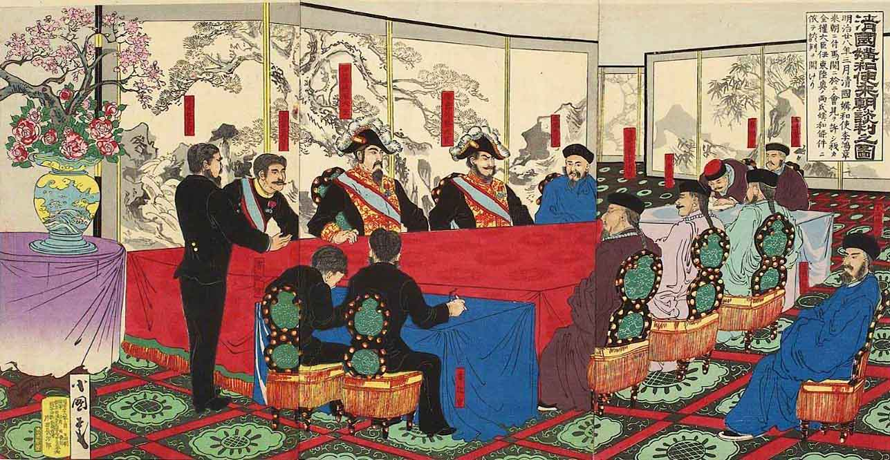
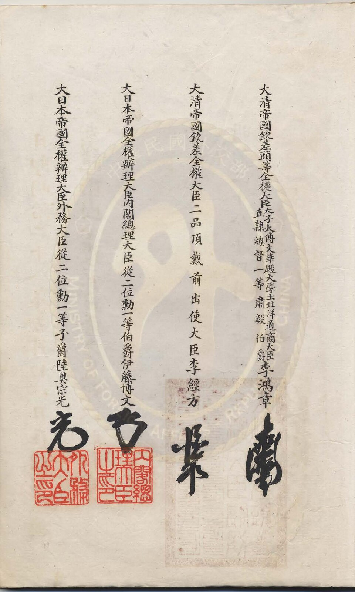
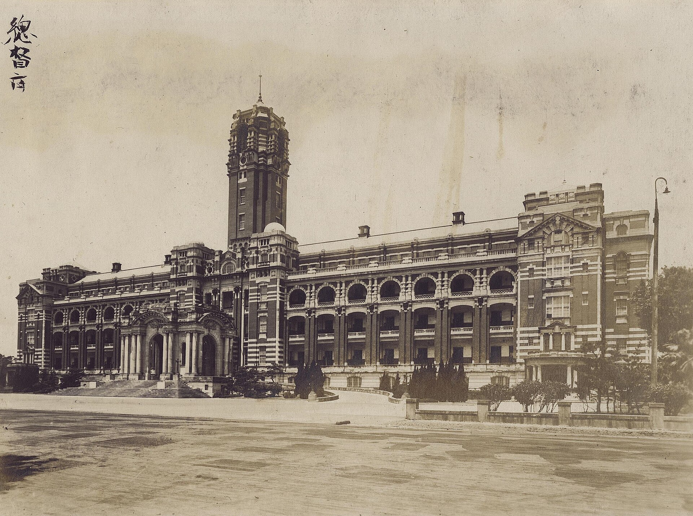
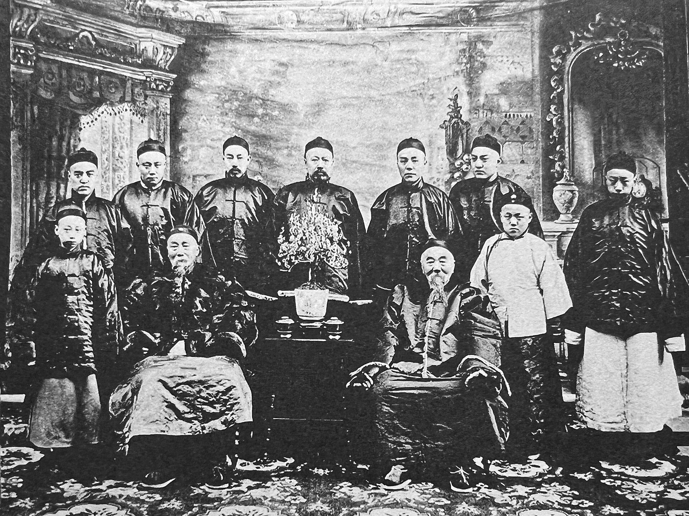
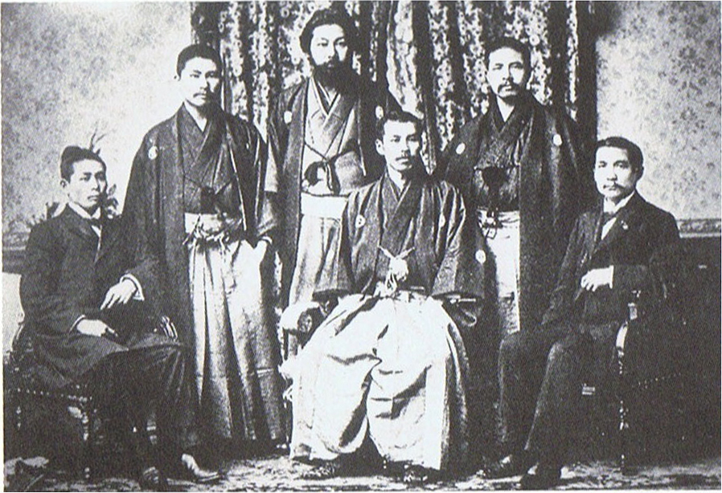

2018 年 5 月 7 日晚上，[李家同](https://zh.wikipedia.org/zh-tw/%E6%9D%8E%E5%AE%B6%E5%90%8C)在臉書上貼了幾張照片。那是三天前總統府開放星戰迷參觀的畫面，有人扮成帝國風暴兵，站在憲兵旁邊一起站哨。他說自己感到非常難過，對他來講，總統府是一個十分莊嚴的地方，不是胡鬧的地方，接著一連問了三個問題：白金漢宮會有這種事嗎？克林姆林宮會有嗎？白宮會有嗎？

接下來發生的事大家都知道。網友翻出兩年前白宮同樣辦過「原力日」的新聞，[歐巴馬](https://zh.wikipedia.org/zh-tw/%E5%B7%B4%E6%8B%89%E5%85%8B%C2%B7%E5%A5%A7%E5%B7%B4%E9%A6%AC)和風暴兵在白宮走廊跳舞；[石明謹](https://zh.wikipedia.org/zh-tw/%E7%9F%B3%E6%98%8E%E8%AC%B9)在臉書上回了兩行：「李家同：我感到非常難過／歐巴馬：你叫我？」整件事成了那個月的網路笑話。

我當時也跟著笑了。後來重看這段往事，在意的反而是另一件沒人提起的事：這棟被他稱為莊嚴的建築，原本叫[台灣總督府](https://zh.wikipedia.org/zh-tw/%E8%87%BA%E7%81%A3%E7%B8%BD%E7%9D%A3%E5%BA%9C)。台灣總督這個職位的第一任，是海軍大將[樺山資紀](https://zh.wikipedia.org/zh-tw/%E6%A8%BA%E5%B1%B1%E8%B3%87%E7%B4%80)。而樺山資紀手上的台灣，是在基隆外海的一艘船上，從一個姓李的清朝官員手裡接過來的。

那個官員叫[李經方](https://zh.wikipedia.org/zh-tw/%E6%9D%8E%E7%B6%93%E6%96%B9)，是李家同祖父的堂兄弟。

## Table of contents

## 一艘不靠岸的船

### 馬關，兩個名字

1895 年春天，[甲午戰爭](https://zh.wikipedia.org/zh-tw/%E7%94%B2%E5%8D%88%E6%88%B0%E7%88%AD)打完了，[北洋艦隊](https://zh.wikipedia.org/zh-tw/%E5%8C%97%E6%B4%8B%E6%B0%B4%E5%B8%AB)沉在威海衛。七十二歲的[李鴻章](https://zh.wikipedia.org/zh-tw/%E6%9D%8E%E9%B4%BB%E7%AB%A0)被派到日本下關議和，談判期間被日本青年[小山豐太郎](https://zh.wikipedia.org/zh-tw/%E5%B0%8F%E5%B1%B1%E8%B1%90%E5%A4%AA%E9%83%8E)開槍打中臉頰，子彈留在左眼下方，他包著繃帶繼續談。

4 月 17 日條約簽成。很多人記得[馬關條約](https://zh.wikipedia.org/zh-tw/%E9%A6%AC%E9%97%9C%E6%A2%9D%E7%B4%84)是李鴻章簽的，比較少人注意到簽名欄上其實有兩個姓李的：欽差頭等全權大臣李鴻章，和欽差全權大臣李經方。後者是他的兒子，嚴格說是養子。李經方原是李鴻章六弟李昭慶的兒子，1862 年李鴻章年過四十仍無子，李昭慶便把這個兒子[過繼](https://zh.wikipedia.org/zh-tw/%E9%81%8E%E7%B9%BC)給哥哥。

條約裡有一條，把台灣、澎湖永遠割讓給日本。條約簽了，還得有人去把東西交出去。清廷選的人，又是李經方。

### 橫濱丸

李經方的頭銜是「交割台灣全權大臣」。這不是一個有人搶著要的差事。

6 月 1 日，李經方搭德國輪船抵達台灣；6 月 2 日上午十點，他帶著翻譯盧永銘、陶大均，在基隆三貂角外海的日本輪船「橫濱丸」上與樺山資紀會面。當天晚上九點完成簽署，文件寫得很清楚，台灣全島、澎湖列島各海口，以及各府縣所有堡壘、軍器工廠與公有物件，全部交給日本。

他沒有上岸。流傳最廣的說法是，樺山問他為什麼不上岸簽署，他說台灣人非常憤慨，怕被暗殺。這段對話我沒有在日方檔案原文裡核對到，但不管細節如何，事實本身已經夠清楚：一座島的主權，是在看得見海岸線的地方，由一個不敢踏上那片土地的人交出去的。

那時島上正在打仗。日軍[近衛師團](https://zh.wikipedia.org/zh-tw/%E8%BF%91%E8%A1%9B%E5%B8%AB%E5%9C%98)四天前已經從澳底登陸，[台灣民主國](https://zh.wikipedia.org/zh-tw/%E8%87%BA%E7%81%A3%E6%B0%91%E4%B8%BB%E5%9C%8B)的黃虎旗還在台北城裡。6 月 5 日，樺山把船上的臨時總督府搬進基隆海關；6 月 17 日，他在原清朝巡撫衙門舉行始政典禮。總督府後來搬進一棟紅磚新建築，1919 年落成，就是今天的總統府。

## 合肥李家

### 輪流當總督的兄弟

要理解李經方為什麼會站在那艘船上，得往上看一代。

合肥磨店鄉的李家，是清末最顯赫的家族之一。[李文安](https://zh.wikipedia.org/zh-tw/%E6%9D%8E%E6%96%87%E5%AE%89)有六個兒子，老大[李瀚章](https://zh.wikipedia.org/zh-tw/%E6%9D%8E%E7%80%9A%E7%AB%A0)，老二李鴻章。李瀚章走的是湘軍的路，曾國藩治湘軍時徵召他主管餉運，1865 年升湖南巡撫，後來長期出任[湖廣總督](https://zh.wikipedia.org/zh-tw/%E6%B9%96%E5%BB%A3%E7%B8%BD%E7%9D%A3)。李鴻章則帶出了淮軍，後來坐上[直隸總督](https://zh.wikipedia.org/zh-tw/%E7%9B%B4%E9%9A%B7%E7%B8%BD%E7%9D%A3)兼北洋大臣，成為朝廷對外交涉的第一人。

最特別的是湖廣總督這個位子。李瀚章前後在湖廣任職四次，都是和弟弟李鴻章交替接任，兩人的母親長年住在武昌的官署裡，時人都認為這是莫大的榮耀。一個家族的兄弟輪流治理兩湖，這種事在清代也不多見。

[兩廣總督](https://zh.wikipedia.org/zh-tw/%E5%85%A9%E5%BB%A3%E7%B8%BD%E7%9D%A3)這個位子，兄弟倆也都坐過。李瀚章 1889 年 8 月接任，做到 1895 年 4 月 13 日卸任。四天後，他弟弟在下關簽下馬關條約。再過五年，坐上同一個位子的人就是李鴻章自己。

李瀚章就是李家同的曾祖父。李鴻章是他的曾叔祖父。

### 封疆大吏是什麼意思

「[封疆大吏](https://zh.wikipedia.org/zh-tw/%E5%B0%81%E7%96%86%E5%A4%A7%E5%90%8F)」這四個字，現在聽起來有點像成語，在清代卻是很具體的官職。

乾隆以後，全國大致固定設八個[總督](https://zh.wikipedia.org/zh-tw/%E7%B8%BD%E7%9D%A3)：直隸、兩江、湖廣、閩浙、兩廣、陝甘、四川、雲貴，清末再加上東三省總督。一個總督管一到三個省，兩江總督就管江蘇、安徽、江西三省，湖廣總督管湖北、湖南。另外還有漕運總督、河道總督，名字裡也有總督二字，但沒有地方行政的責任，性質不同。

總督本官是正二品，照例兼兵部尚書和都察院右都御史的頭銜，實際上就是從一品。兵部尚書的頭銜讓他可以調動轄區的綠營，右都御史的頭銜讓他可以彈劾轄下官員。他底下還有巡撫，以及各省的布政使、按察使，提督雖然也是從一品武官，同樣得聽總督差遣。如果再加上大學士的頭銜，就是正一品，李鴻章就是這種。

用今天的話來說，一個總督手上同時握著幾個省的行政、財稅、司法監察和地方軍隊。能約束他的只有皇帝，以及八旗駐防將軍，後者大多是滿人，專管旗兵，與加銜的總督平級。總督的權力很大，但八旗從來不歸他管，這是清廷留給自己的保險。

台灣在 1885 年建省之前，一直屬於福建，歸閩浙總督管。所以對十九世紀的台灣人來說，「總督」這兩個字並不陌生，只是在 1895 年之後，坐在那個位子上的人換成了日本海軍大將。

## 1900 年的另一個提議

### 東南互保

馬關條約簽完四年多，李鴻章被派去廣州當兩廣總督。1899 年 12 月任命下來，他 1900 年 5 月才到任。那一年北方出了大事。

[義和團](https://zh.wikipedia.org/zh-tw/%E7%BE%A9%E5%92%8C%E5%9C%98)進了北京。1900 年 6 月 21 日，[慈禧](https://zh.wikipedia.org/zh-tw/%E6%85%88%E7%A6%A7%E5%A4%AA%E5%90%8E)不顧[光緒](https://zh.wikipedia.org/zh-tw/%E5%85%89%E7%B7%92%E5%B8%9D)和主和大臣的反對，下詔招撫義和團，同時向十一國宣戰。朝廷的命令一到南方，幾個手握重兵的總督巡撫都不肯照辦：兩廣的李鴻章、兩江的[劉坤一](https://zh.wikipedia.org/zh-tw/%E5%8A%89%E5%9D%A4%E4%B8%80)、湖廣的[張之洞](https://zh.wikipedia.org/zh-tw/%E5%BC%B5%E4%B9%8B%E6%B4%9E)、閩浙的[許應騤](https://zh.wikipedia.org/zh-tw/%E8%A8%B1%E6%87%89%E9%A8%B0)，還有山東巡撫[袁世凱](https://zh.wikipedia.org/zh-tw/%E8%A2%81%E4%B8%96%E5%87%B1)，彼此串連，公然違背朝廷命令，不向外國開戰，並且和各國約定互不侵犯。這就是「[東南互保](https://zh.wikipedia.org/zh-tw/%E6%9D%B1%E5%8D%97%E4%BA%92%E4%BF%9D)」。據說李鴻章當時回電朝廷，只有一句「此亂命也，粵不奉詔」。

東南互保的意思很簡單：北京瘋了，南方各省自己保自己。這已經是地方大員對中央的半公開抗命。有人看到了更進一步的可能。

### 沒有上岸的孫文

香港總督[卜力](https://zh.wikipedia.org/zh-tw/%E5%8D%9C%E5%8A%9B)想得最遠。[何啟](https://zh.wikipedia.org/zh-tw/%E4%BD%95%E5%95%9F)和興中會起草了一份叫《平治章程》的方案，由何啟翻成英文交給卜力，主張在西方大國的監護下重組中國的政治制度，各省設自治政府。李鴻章這一邊，也透過幕僚[劉學詢](https://zh.wikipedia.org/zh-tw/%E5%8A%89%E5%AD%B8%E8%A9%A2)聯絡[孫文](https://zh.wikipedia.org/zh-tw/%E5%AD%AB%E4%B8%AD%E5%B1%B1)。劉學詢給孫文發了一封電報，說李鴻章因北方拳亂，想讓廣東獨立，希望孫文速來廣州協助。孫文回說，這事若成，也是大局之福，不妨一試。

孫文真的來了，船開到香港海面，最後卻沒有上岸去廣州。他收到報告說李鴻章還沒下定決心，另有消息說總督府裡有人設陷阱要抓他，於是只派日本人[宮崎寅藏](https://zh.wikipedia.org/zh-tw/%E5%AE%AE%E5%B4%8E%E6%BB%94%E5%A4%A9)代表他去談。劉學詢轉述李鴻章的意思：各國還沒攻下北京之前，他不便有所表示。

李鴻章在等。等北京的結局，等慈禧會不會倒台。7 月 8 日，慈禧任命他為直隸總督兼北洋大臣，要他回北方收拾殘局。他判斷朝局正在往有利於主和派的方向變，決定北上。路過香港時，卜力當面跟他說，這是兩廣脫離清廷獨立的好機會，獨立後由他當領導人，孫文只當顧問。李鴻章沒有回答。

倫敦也不買帳。殖民地大臣[張伯倫](https://zh.wikipedia.org/zh-tw/%E7%B4%84%E7%91%9F%E5%A4%AB%C2%B7%E5%BC%B5%E4%BC%AF%E5%80%AB)再三下令卜力不准採取任何行動，後人所說的「[兩廣共和國](https://zh.wikipedia.org/zh-tw/%E5%85%A9%E5%BB%A3%E5%85%B1%E5%92%8C%E5%9C%8B)」，從頭到尾只停留在香港總督府和幾個幕僚之間。

### 朝廷的事後追認

北京的反應，比南方的抗命更耐人尋味。

東南督撫抗命的理由，是說宣戰詔書不是太后和皇帝的本意，而是被拳民挾持下發出的矯詔，是「亂命」。這是一個所有人都知道不太可能成立的說法，但它替雙方都留了退路。總督可以說自己不是在違抗朝廷，而是在保護被挾持的朝廷；朝廷則可以接著這個說法往下演。

慈禧也真的演了。宣戰之後五天，1900 年 6 月 26 日的上諭裡，對督撫的違旨一個字都沒有責備，反而說「爾各督撫度勢量力，不欲輕構外釁，誠老成謀國之道」，還說朝廷的看法和他們正好相同。

一個剛向十一國宣戰的朝廷，公開表揚那些拒絕參戰的地方大員，說大家意見一致。這份上諭的意思，說穿了就是：你們違抗的那道命令，我現在當它不存在。

戰爭結束後，也沒有人被追究。劉坤一加封太子太保，[盛宣懷](https://zh.wikipedia.org/zh-tw/%E7%9B%9B%E5%AE%A3%E6%87%B7)賞加太子少保，張之洞和袁世凱後來先後進京當了軍機大臣。1901 年初，還在西安避難的慈禧以光緒名義下詔變法；同年六月，劉坤一、張之洞聯名上了三道奏摺，一般稱「江楚會奏變法三摺」，成了[清末新政](https://zh.wikipedia.org/zh-tw/%E6%B8%85%E6%9C%AB%E6%96%B0%E6%94%BF)的藍本。當初抗命的人，轉身成了替朝廷設計未來的人。

東南互保在法律上從來沒有被承認是抗命，它被朝廷事後收編成了「朝廷本意」。帝國的權威還在，只是從那年夏天起，每個人都知道那份權威可以被總督們繞過去，而朝廷只能在事後補上一道上諭，說自己早就同意了。十一年後，南方各省一個接一個宣布獨立，那時已經沒有人需要再找「矯詔」這種理由。

李鴻章沒有等到那一天。1901 年，他在北京簽下《[辛丑條約](https://zh.wikipedia.org/zh-tw/%E8%BE%9B%E4%B8%91%E6%A2%9D%E7%B4%84)》，兩個月後病逝。

這段歷史放在台灣的脈絡裡看，有一個很難忽視的對稱。1895 年 5 月，台灣士紳為了抗拒馬關條約，宣布成立台灣民主國，想用「自主」保住這座島。那份條約是李鴻章簽的。五年後，輪到有人勸李鴻章本人「自主」，想讓兩廣脫離北京。一個被他的簽名逼出來的共和國，和一個他自己沒有接下的共和國，前後只隔了五年。

他在廣州沒有回答卜力的問題，就像他的兒子在基隆外海沒有上岸。

## 上海，1938

### 正月初五

李家同的父親李國瑊是經濟學家。李國瑊的生父是李瀚章的三子李經滇，後來過繼到九房李經淮名下。簽馬關條約的李經方，也是過繼來的。

李家同出生在上海。

他的生日有兩種說法。較早的資料寫 1939 年 1 月 5 日，現在的維基百科改成 1938 年 2 月 4 日。他自己講過：「我的身分證生日是 1 月 5 日，其實這是不對的，我的真正生日是農曆正月初五。」

李鴻章生於道光三年正月初五。1938 年的農曆新年是 1 月 31 日，正月初五換算成國曆，剛好是 2 月 4 日。兩種日期其實指向同一件事：他生在 1938 年的農曆正月初五，而「1 月 5 日」看起來是有人把「正月初五」直接抄成了國曆。另有一種流傳的說法，說他就是因為和李鴻章同一天生日才取名「家同」，這一段我沒找到他本人的說法可以證實。

1938 年初的上海，華界已經在前一年冬天淪陷，只剩租界被日軍團團圍住，後來的人稱為「孤島」。我不知道李家當時住在哪裡。但如果這個日期是對的，那麼簽字把台灣交給日本的那個家族，四十三年後的下一代，是在日軍包圍的城市裡出生的。

### 「我是我」

李家同在上海讀完小學，後來全家渡海來台。確切是哪一年，我目前還沒查到。父親李國瑊在台灣教過清華大學，也當過省立法商學院的教授和教務長。

這個家族在台灣幾乎不提過去。李家同在一次訪談裡說，李氏家族在大陸很龐大，但家族聚會他沒參加過，那些場合老是在講過去的輝煌家族史，他不習慣；父親很少提家世，他甚至到現在都沒看過曾祖父的照片。有雜誌社曾經想做「名人之後」的專訪，找上他父親，父親拒絕了，理由是「我是我」。

他自己的態度也差不多。他說生長在好的家庭是好事，但追溯到好幾代就沒有意義，並舉拿破崙、林肯、洛克斐勒為例，問他們的後代在哪裡，大概也沒人知道。

我讀到這段的時候，想起那艘停在三貂角外海的船。李瀚章那一代把家族帶到權力的頂點，李鴻章和李經方在馬關與基隆替這個頂點付了帳。到了李國瑊，一句「我是我」，把這一切關在門外。一個孩子可以在台灣長大、讀書、出國、回來當大學校長，卻沒看過自己曾祖父的臉。這很難說是遺忘，比較像是刻意的選擇。

## 留下來的人

1895 年，李經方沒有上岸。

五十多年後，他的堂姪帶著一家人上岸了，而且沒有再離開。李家同在這座島上讀完[台大](https://zh.wikipedia.org/zh-tw/%E5%9C%8B%E7%AB%8B%E8%87%BA%E7%81%A3%E5%A4%A7%E5%AD%B8)電機系，到[柏克萊](https://zh.wikipedia.org/zh-tw/%E5%8A%A0%E5%B7%9E%E5%A4%A7%E5%AD%B8%E6%9F%8F%E5%85%8B%E8%90%8A%E5%88%86%E6%A0%A1)拿了博士，回來教書，從[清華](https://zh.wikipedia.org/zh-tw/%E5%9C%8B%E7%AB%8B%E6%B8%85%E8%8F%AF%E5%A4%A7%E5%AD%B8)的教務長做到[靜宜](https://zh.wikipedia.org/zh-tw/%E9%9D%9C%E5%AE%9C%E5%A4%A7%E5%AD%B8)和[暨南](https://zh.wikipedia.org/zh-tw/%E5%9C%8B%E7%AB%8B%E6%9A%A8%E5%8D%97%E5%9C%8B%E9%9A%9B%E5%A4%A7%E5%AD%B8)的校長，2009 年被聘為總統府資政。退休以後，他把大部分力氣放在南投埔里的[博幼基金會](https://www.boyo.org.tw/)，教偏鄉孩子英文和數學。

他在這座島上住了七十幾年。李經方當年連岸都沒上。

這樣講下去，很容易變成他是在替祖先還債。我不想這樣寫，他本人大概也不會接受。他幾十年來的發言，從星戰日到雙語政策，從廢死到起立敬禮，爭議很多，有的我同意，有的不同意，但裡面找不到任何一句是從「我是李鴻章家的人」出發的。2018 年他[反對雙語國家政策](https://news.tvbs.com.tw/politics/981626)，理由是亞洲很多雙語國家從前都是英國的殖民地，而台灣從來不是英國的殖民地。這句話講的是英國，完全正確。只是台灣確實當過五十年的殖民地，而那段歷史的第一個簽名，有一個跟他同姓、同一個祖宗的人。我相信他講這句話的時候，心裡想的是語言教育，不是 1895 年。

他不是帶著什麼家族使命長大的，也沒有回頭去認這段過去。祖上在船上把台灣交了出去，他在台灣過了大半輩子，中間隔著父親那句「我是我」。

他說追溯好幾代沒有意義。對他個人來說，大概是真的。只是 1895 年 6 月 2 日那份交接文書上的簽名，和 2018 年那則抱怨總統府不夠莊嚴的臉書貼文，出自同一個家族。
