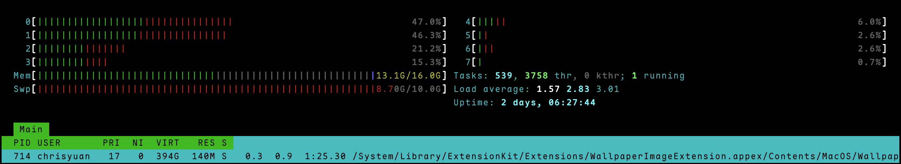

## Table of contents

## 虛擬記憶體的基本概念

在現代作業系統中，[虛擬記憶體](https://zh.wikipedia.org/zh-tw/%E8%99%9A%E6%8B%9F%E5%86%85%E5%AD%98)（[Virtual Memory](https://en.wikipedia.org/wiki/Virtual_memory)）是一項重要的記憶體管理技術。它的主要用途是讓系統能夠執行超過實體記憶體（RAM）容量的程式。當實體記憶體不足時，作業系統會將暫時不使用的資料從記憶體移到硬碟上的特定區域，需要時再載入回來，這個過程稱為「記憶體交換」（Memory Swapping）。

虛擬記憶體不僅解決了記憶體不足的問題，還提供了記憶體保護機制，讓每個程式都擁有獨立的記憶體空間，避免程式之間互相干擾。

### 分頁式記憶體管理

macOS 採用分頁式記憶體管理（Paging），將記憶體劃分為固定大小的頁面（Page）。在 Apple Silicon 上，每個頁面預設為 16KB；在 Intel Mac 上則為 4KB。當應用程式存取的記憶體位址不在實體記憶體中時，會觸發「頁面錯誤」（Page Fault），核心會將需要的頁面從磁碟載入。

這種機制讓每個程式都以為自己擁有完整的記憶體空間，實際上核心在背後動態地將虛擬位址對應到實體記憶體或磁碟上的 swap 空間。

## macOS 的 Swap 機制

在 macOS 中，用於虛擬記憶體的交換檔案（Swap file）統一存放在 `/System/Volumes/VM` 目錄下。這個目錄通常對一般使用者是隱藏的，需要特殊權限才能查看。

macOS 的 swap 機制有個獨特的設計：系統會根據需要動態建立多個 1GB 大小的 swap file。舉例來說，如果系統需要 3GB 的交換空間，就會在該目錄下產生 3 個名為 `swapfile0`、`swapfile1`、`swapfile2` 的檔案，每個都是 1GB。

```bash
bash-5.2$ ls -lh /System/Volumes/VM/
total 20971520
-rw-------  1 root  wheel   1.0G  6  9 10:57 swapfile0
-rw-------  1 root  wheel   1.0G  6  9 11:11 swapfile1
-rw-------  1 root  wheel   1.0G  6  9 11:20 swapfile2
-rw-------  1 root  wheel   1.0G  6  9 12:31 swapfile3
-rw-------  1 root  wheel   1.0G  6 11 09:23 swapfile4
-rw-------  1 root  wheel   1.0G  6  9 15:05 swapfile5
-rw-------  1 root  wheel   1.0G  6  9 22:18 swapfile6
-rw-------  1 root  wheel   1.0G  6 10 10:09 swapfile7
-rw-------  1 root  wheel   1.0G  6 11 09:40 swapfile8
-rw-------  1 root  wheel   1.0G  6 11 15:54 swapfile9
```



這種動態管理機制相當智慧——當您開啟較多應用程式，實體記憶體不敷使用時，macOS 會自動增加 swap file 的數量；反之，當記憶體壓力減輕後，系統也會適時清理不需要的 swap file，釋放硬碟空間。

### Swap 加密

macOS 預設會對 swap file 進行 AES 加密。這是一項重要的安全機制——即使有人取得磁碟的實體存取權限，也無法從 swap file 中讀取應用程式曾經使用的敏感資料（密碼、金鑰等）。加密金鑰在每次開機時重新產生，關機後舊的 swap 內容便無法解密。

可以透過以下指令確認 swap 加密狀態：

```bash
sysctl vm.swapusage
# vm.swapusage: total = 10240.00M  used = 7257.50M  free = 2982.50M  (encrypted)
```

輸出末尾的 `(encrypted)` 表示 swap 已啟用加密。

## 壓縮記憶體

macOS 自 Mavericks（10.9）起引入了[壓縮記憶體](https://support.apple.com/en-us/102650)（Compressed Memory）機制。當記憶體壓力升高時，系統不會立即將資料寫入 swap，而是先嘗試壓縮記憶體中較少使用的頁面。

這個設計帶來幾個明顯的好處：

- **速度更快**：壓縮 / 解壓縮記憶體資料的速度遠高於磁碟 I/O，延遲在微秒等級而非毫秒
- **減少 swap 使用**：壓縮後的頁面仍留在記憶體中，減少對磁碟的依賴
- **延長 SSD 壽命**：減少寫入次數有助於延長儲存裝置壽命

macOS 的記憶體回收順序為：

1. 釋放可重建的快取頁面（Purgeable / Speculative）
2. 壓縮不活躍的記憶體頁面
3. 將壓縮後仍放不下的資料寫入 swap file

可以透過 `vm_stat` 觀察壓縮記憶體的使用情況：

```bash
bash-5.2$ vm_stat
Mach Virtual Memory Statistics: (page size of 16384 bytes)
Pages free:                               47892.
Pages active:                            411818.
Pages inactive:                          399498.
Pages speculative:                          3498.
Pages throttled:                               0.
Pages wired down:                         155388.
Pages purgeable:                           18764.
"Translation faults":                  593841281.
Pages copy-on-write:                    23227498.
Pages zero filled:                     282564498.
Pages reactivated:                      22564187.
Pages purged:                            6421032.
File-backed pages:                        205836.
Anonymous pages:                          608978.
Pages stored in compressor:               833641.
Pages occupied by compressor:             303484.
```

其中 `Pages stored in compressor` 是被壓縮前的頁面數量，`Pages occupied by compressor` 是壓縮後實際佔用的頁面數量。以上面的輸出為例，壓縮比約為 833641 / 303484 ≈ 2.75 倍——也就是說壓縮機制讓系統多出了約 (833641 - 303484) × 16KB ≈ 8GB 的可用空間。

## 記憶體壓力層級

macOS 核心根據可用記憶體的比例，將記憶體壓力分為四個層級：

| 層級         | 說明           | 系統行為                                                         |
| ------------ | -------------- | ---------------------------------------------------------------- |
| **Normal**   | 記憶體充足     | 正常運作，不做額外回收                                           |
| **Warn**     | 記憶體開始緊張 | 積極壓縮不活躍頁面，開始寫入 swap                                |
| **Critical** | 記憶體嚴重不足 | 大量 swap 活動，系統可能明顯卡頓                                 |
| **Terminal** | 接近記憶體耗盡 | 核心可能強制終止佔用最多記憶體的程式（類似 Linux 的 OOM Killer） |

在「活動監視器」中，記憶體壓力圖表以綠色、黃色、紅色分別對應 Normal、Warn、Critical 狀態。

也可以用 CLI 工具查詢當前壓力：

```bash
# 查看記憶體壓力等級
memory_pressure
# System-wide memory free percentage: 24%
# System memory pressure level: The system memory pressure level is Normal
```

## Apple Silicon 與統一記憶體

Apple Silicon 採用統一記憶體架構（Unified Memory Architecture, UMA），CPU、GPU 和 Neural Engine 共享同一塊實體記憶體。這與 Intel Mac 的獨立顯示記憶體（VRAM）架構有本質上的不同。

這對虛擬記憶體機制帶來幾個影響：

- **GPU 記憶體壓力共享**：GPU 密集的工作（如影片編輯、3D 渲染）會和一般應用程式競爭同一塊記憶體，可能更快觸發 swap
- **頁面大小差異**：Apple Silicon 使用 16KB 頁面（Intel 為 4KB），較大的頁面讓 TLB（Translation Lookaside Buffer）快取效率更高，但也意味著即使只需要 1 byte，每次調度的最小單位也是 16KB
- **SSD 作為 swap 的效能**：Apple Silicon Mac 的內建 SSD 速度極快（讀取可達 7GB/s 以上），讓 swap 的效能懲罰相對較小，但仍遠不及直接存取記憶體

## 監控與診斷

### 活動監視器

最直覺的方式是開啟「活動監視器」（Activity Monitor）→「記憶體」分頁，可以看到：

- **記憶體壓力**圖表：綠色 = 正常，黃色 = 警告，紅色 = 危急
- **已使用交換**（Swap Used）：目前 swap 使用量
- **壓縮的記憶體**（Compressed）：被壓縮的記憶體量
- 各程式的記憶體用量與壓縮狀態

### CLI 工具

除了前面提到的 `vm_stat` 和 `memory_pressure`，還有幾個實用的指令：

```bash
# 查看 swap 使用量
sysctl vm.swapusage
# vm.swapusage: total = 10240.00M  used = 7257.50M  free = 2982.50M  (encrypted)

# 查看總體記憶體統計
top -l 1 -s 0 | head -n 12

# 查看各程式記憶體用量（依 resident memory 排序）
ps aux --sort=-%mem | head -n 20
```

`sysctl vm.swapusage` 顯示的 total 是目前已建立的 swap file 總容量，used 是實際使用量。如果 used 接近 total，系統可能會再建立新的 swap file。

## 實際建議

在日常使用中，如果您發現 Mac 執行速度變慢，可以透過「活動監視器」查看記憶體壓力。當看到「已使用交換」（Swap Used）顯示數值時，就表示系統正在使用虛擬記憶體。

以下是一些實用建議：

- **記憶體壓力長期黃色或紅色**：考慮關閉不需要的應用程式，或評估是否需要更多記憶體
- **Swap 使用量持續偏高**：檢查是否有記憶體洩漏的應用程式（活動監視器中記憶體用量持續攀升的程式）
- **不需要手動清除 swap**：macOS 會自動管理，強制清除反而可能造成效能問題
- **重開機可以重置**：如果 swap 用量異常高，重新啟動是最直接的方式，系統會清除所有 swap file 並重新開始
- **選購建議**：Apple Silicon Mac 的記憶體無法事後升級，選購時建議根據工作負載預留足夠的記憶體——8GB 適合輕度使用，16GB 以上適合開發與多工作業
