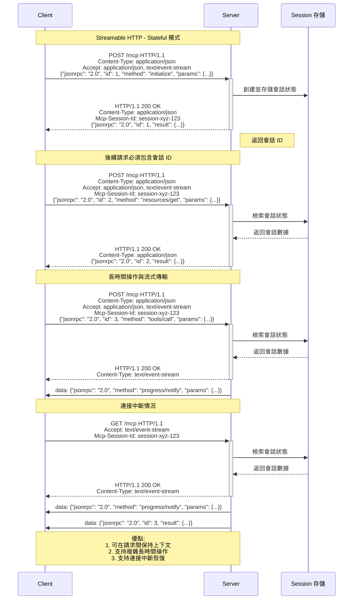

在 [2025-03-26 Key Changes](https://modelcontextprotocol.io/specification/2025-03-26/changelog) 的 [Major changes](https://modelcontextprotocol.io/specification/2025-03-26/changelog#major-changes) 第二項明確指出：

> Replaced the previous HTTP+SSE transport with a more flexible [**Streamable HTTP transport**](https://modelcontextprotocol.io/specification/2025-03-26/basic/transports#streamable-http) (PR [#206](https://github.com/modelcontextprotocol/specification/pull/206))

相較於 [2024-11-05 版本中關於 HTTP with SSE 的描述](https://modelcontextprotocol.io/specification/2024-11-05/basic/transports#http-with-sse)，[2025-03-26 版本的 Streamable HTTP](https://modelcontextprotocol.io/specification/2025-03-26/basic/transports#streamable-http) 在 client 端與 server 端間的互動行為變得更為複雜但也更為強大。以下我們將深入分析這些變化。

# 第一版（2024-11-05）：HTTP with SSE

在 2024-11-05 的 MCP 規範版本中，HTTP with SSE([Server-sent events](https://en.wikipedia.org/wiki/Server-sent_events)) 傳輸層的工作方式如下：

## 1 雙重 endpoint 機制

當 client 端連接時，必須使用兩個分離的 endpoint：

- 一個用於接收 SSE event（通常是 `/sse`）
- 另一個用於發送消息（通常是 `/messages`）

這種設計就像使用兩支電話進行對話，一支用來接聽，另一支用來發話，使架構變得複雜且不直觀。

## 2 連接建立流程

1. client 端首先通過 HTTP 連接到 server 端
2. server 端必須發送一個 endpoint event，包含 client 端用於發送消息的 URI
3. 所有後續 client 端消息必須作為 HTTP POST 請求發送到此 endpoint
4. server 端消息作為 SSE message event 發送，事件數據中的消息內容以 JSON 編碼

## 3 持久連接要求

由於 SSE 作為一個持久的單向通道運作，允許 server 端向 client 端推送更新，如果連接過早關閉，client 端將錯過在長時間運行操作期間從 MCP server 發送的響應或更新。

## 4 缺乏雙向通信

舊版傳輸層的設計讓 client 端和 server 端之間的通信相對複雜，尤其是對於需要雙向通信的情況。由於需要維護兩個不同的通信通道，增加了實現的複雜性和可能的失敗點。

## 5 Sequence Diagram


# 第二版（2025-03-26）：Streamable HTTP

在 2025-03-26 的最新 MCP 規範中，Streamable HTTP 傳輸層解決了上述問題，提供了更靈活且強大的通信機制：

## 1 單一端點架構

Server 端必須提供一個同時支援 POST 和 GET method 的單一 HTTP endpoint 路徑（稱為 MCP endpoint）。例如：`https://example.com/mcp`

這種設計使所有 MCP 交互都通過一個 endpoint 流動，消除了管理單獨請求和響應 endpoint 的需要，從而降低了複雜性。

## 2 靈活的響應升級機制

Client 端必須告訴 server 端它能處理兩種不同的 `Content-Type` 的響應內容格式，即 client 端 request 的 `Accept` header 必須是 `application/json, text/event-stream`。

在 Streamable HTTP 中，client 端向 MCP endpoint 發送 POST request 時，可能包含一個或多個 [JSON-RPC](https://www.jsonrpc.org/) 請求。Server 端需要根據情況選擇合適的 response 方式：

### 1 若適合立即回應

Server 端可以選擇返回 `Content-Type: application/json`，提供一個標準的 JSON object 作為 response。這適用於**不需要長時間處理或 streaming 更新的簡單 request**。

### 2 若需要 streaming 傳輸或長時間處理

服務器可以選擇返回 `Content-Type: text/event-stream`，啟動一個 SSE streaming。這允許 server 端：

- 在處理過程中發送進度通知
- 在完成時發送最終響應
- 在必要時向 client 端發送請求
- 在單次連接中發送多個消息

例如，當 client 端請求執行一個需要較長時間的工具呼叫時，server 端可以立即升級為 SSE streaming，然後：

1. 首先發送進度更新（如 "處理中，已完成 25%"）
2. 繼續發送更多進度更新
3. 最終在操作完成時發送結果
4. 可選擇在之後關閉 SSE 流

這種機制的靈活性在於 server 端可以根據任務的性質動態選擇合適的 response 模式，而 client 端需要能夠處理這兩種可能的 response 類型。

這比舊的 HTTP with SSE 方式更靈活，因為在舊方式中，client 端和 server 端需要使用不同的 endpoint 進行通信，而新方式允許在同一個 request-response loop 中實現相同的功能，簡化了整體架構。


## 3 改進的 session 管理

使用 Streamable HTTP 傳輸的 server 端可以在初始化時分配 session ID，方法是在包含 `InitializeResult` 的 HTTP 響應上包含一個 `Mcp-Session-Id` header。會話 ID 應全局唯一且密碼學安全（例如，安全生成的 UUID、JWT 或加密雜湊）。



## 4 雙向通信能力

Server 端可以通過同一連接向 client 端發送通知和請求，使 server 端能夠提示額外信息或提供實時更新。這顯著增強了 MCP Server 的交互能力，使複雜的協作場景成為可能。

## 5 Stateless 選項

Streamable HTTP 設計中的 stateless 選項是一項重要的架構改進，讓開發者能夠根據需求選擇是否實現 stateful 或 stateless 的 MCP Server。這對於 production 環境中的可擴展性有顯著影響。

### 1 Stateless 運作方式

- **Session ID是可選的**：在 Streamable HTTP 規範中，服務器**可以**（MAY）在初始化時分配 Session ID，但這不是必需的。規範明確使用「MAY」而非「MUST」，表明這是一個選擇性而非強製性的。
- **單一 request-response 模式**：Streamable HTTP 允許 server 端以純粹的 request-response 模式工作，不需要在請求之間保持任何狀態。每次 client 端發送 JSON-RPC 請求，服務器可以處理請求並返回結果，無需 trace 之前的交互。
- **即使長時間操作也能保持無狀態**：對於需要發送進度通知或多個響應的長時間操作，server 端可以在單一 HTTP request 的 context 中使用 SSE streaming 完成所有通信，不需要跨 request 維護狀態。
  ```mermaid
  sequenceDiagram
      participant Client as Client
      participant Server as Server

      note over Client,Server: Streamable HTTP - Stateless 模式

      Client->>+Server: POST /mcp HTTP/1.1<br/>Content-Type: application/json<br/>Accept: application/json, text/event-stream<br/>{"jsonrpc": "2.0", "id": 1, "method": "initialize", "params": {...}}

      Server-->>-Client: HTTP/1.1 200 OK<br/>Content-Type: application/json<br/>{"jsonrpc": "2.0", "id": 1, "result": {...}}
      note right of Server: 無 Mcp-Session-Id header<br/>不保留任何狀態

      note over Client,Server: 每個請求完全獨立，無共享狀態

      Client->>+Server: POST /mcp HTTP/1.1<br/>Content-Type: application/json<br/>Accept: application/json, text/event-stream<br/>{"jsonrpc": "2.0", "id": 2, "method": "tools/call", "params": {...}}

      Server-->>-Client: HTTP/1.1 200 OK<br/>Content-Type: text/event-stream

      Server->>Client: data: {"jsonrpc": "2.0", "method": "progress/notify", "params": {...}}
      Server->>Client: data: {"jsonrpc": "2.0", "id": 2, "result": {...}}

      note over Client,Server: SSE 流僅用於當前請求的響應<br/>流關閉後不保留任何狀態

      Client->>+Server: POST /mcp HTTP/1.1<br/>Content-Type: application/json<br/>Accept: application/json, text/event-stream<br/>{"jsonrpc": "2.0", "id": 3, "method": "tools/call", "params": {...}}

      Server-->>-Client: HTTP/1.1 200 OK<br/>Content-Type: application/json<br/>{"jsonrpc": "2.0", "id": 3, "result": {...}}

      note over Client,Server: 即使是同一 client，server 也不記得之前的互動

      note over Client,Server: 優點:<br/>1. 簡單部署架構<br/>2. 易於水平擴展<br/>3. 負載均衡友好<br/>4. 高容錯性
  ```

### 2 Stateful 與 Stateless 的選擇

Stateless 選項的靈活性體現在：

- **簡化 Simple Server 的實作**：對於功能相對簡單的 MCP Server，可以完全 stateless 實現，不需要設置 session 管理、在資料庫或 Message Queue 儲存會話狀態。
- **水平擴展能力**：Stateless server 可以輕鬆水平擴展，因為任何 server instance 都可以處理任何傳入請求，無需關心 request 是否應該被 route 到特定 instance。
- **有狀態需求的支持**：對於需要跨 request 維護 context 的複雜場景，server 端可以選擇實現 stateful 模式，使用 `Mcp-Session-Id` header 維護 session。

### 3 對 production 系統的意義

在大規模 production 環境中，stateless 選項帶來的好處包括：

- **簡化的部署架構**：不需要設置 session 持久化層或共享狀態機制。
- **更好的容錯性**：因為沒有狀態依賴，即使某個 server instance 故障，其他 instance 可以無縫接管處理 request。
- **負載均衡友好**：request 可以分發到任何可用的 server instance，而不需要考慮 session affinity（會話親和性）。
- **資源效率**：不需要為維護和同步狀態分配額外的系統資源。

與舊版 HTTP with SSE 相比，舊版總是需要至少一個 long-live connection 來接收 server 端的推送消息，這使得實現真正的 stateless server 變得困難。新的 Streamable HTTP 通過允許 server 端在需要時才使用 SSE streaming，而其餘時間保持 stateless，顯著提高了架構選擇的靈活性。

## 6 Resumability and Redelivery 機制

Streamable HTTP 引入了重要的 Resumability and Redelivery（可恢復性和重新傳遞）機制，這是針對不穩定網絡環境下通信可靠性的重要改進。

### 1 為什麼需要 Resumability and Redelivery

在實際應用場景中，特別是涉及長時間運行的操作（如大型資料處理、複雜運算或持續監控任務）時，網絡連接可能會因為各種原因中斷：

- 網絡不穩定或網絡切換
- client 端設備休眠
- server 端負載平衡或重啟
- 臨時服務中斷

在舊版的 HTTP+SSE 傳輸中，如果 SSE 連接中斷，client 端很可能會丟失在中斷期間 server 端發送的所有消息，導致數據不完整或操作失敗。

### 2 機制原理

Streamable HTTP 的 Resumability 機制利用了 SSE 協議中的 event ID 特性，並結合 MCP 的會話管理，實現了連接中斷後的有效恢復：

- server 端會為發送的每個 SSE 事件分配一個唯一的 ID（通過 `id:` 字段）
- 這些 ID 在特定 SSE 流內按順序分配，作為該流內的游標
- server 端會臨時存儲已發送的消息及其 ID，以便在需要時重新發送

當 SSE 連接中斷後，client 端可以通過以下步驟恢復連接：

1. client 端記錄最後成功接收的事件 ID
2. client 端向 MCP endpoint 發送 GET 請求，包含以下關鍵信息：
   - `Accept: text/event-stream` header，請求 SSE 流
   - `Mcp-Session-Id` header，指定會話 ID（如果是有狀態會話）
   - `Last-Event-ID` header，指定最後接收的事件 ID
3. server 端收到帶有 `Last-Event-ID` 的請求後，可以：
   - 檢索指定 ID 之後的所有未送達消息
   - 重新傳送這些消息，確保 client 端不會遺漏任何信息
   - 繼續發送新的消息

### 3 實現考量與控制策略

在實現 Resumability 機制時，MCP SDK 開發者需要考慮多方面的因素並設計適當的控制策略：

- **功能開關**：考慮提供啟用或禁用流恢復功能的選項，讓使用者可以根據需求決定是否使用此功能
- **資源控制**：設計消息歷史的存儲策略，包括保留時間限制和存儲大小限制，以防止資源耗盡
- **重連策略**：實現智能的重連機制，包括退避算法和最大嘗試次數限制
- **清理策略**：定期清理過期的消息歷史記錄，以優化性能
- **度量收集**：提供監控和診斷工具，以幫助追蹤恢復機制的效能和問題

具體的參數名稱和默認值應由 SDK 開發者根據其實現細節和目標用戶群體來決定。

### 4 與會話管理的關係

Resumability 機制與 Streamable HTTP 的會話管理緊密相關，但又有所區別：

- **會話（Session）**：跨請求維持狀態和上下文，使用 `Mcp-Session-Id` 標識
- **流恢復（Resumability）**：在單個 SSE 流內確保消息不丟失，使用 `Last-Event-ID` 實現

在實踐中，這兩者通常結合使用：

- 會話提供了較長期的上下文跟踪
- 流恢復確保了單次長時間操作中的消息完整性
- 通過同時使用 `Mcp-Session-Id` 和 `Last-Event-ID`，可以精確地恢復到中斷前的狀態

# 主要考量因素和技術優勢

新版 Streamable HTTP 傳輸層的設計考慮了以下因素：

## 1 架構簡化

不再需要像以前那樣有兩個獨立的 endpoint。Client 端可以直接從 MCP endpoint streaming 接收 server response。Server 端可以決定是以 streaming response 還是標準 HTTP response 來回應，大大簡化了系統架構。

## 2 擴展性提升

簡化協議，使用單一連接點，允許 server 更靈活地決定何時使用 streaming 傳輸與一次性響應，並在適當時啟用完全 stateless 的 server 實現。這使系統更容易擴展，特別是在需要處理大量並發連接的情況下。

## 3 基礎設施兼容性

遵循標準 HTTP 模式更為緊密，使其更容易實現和部署。純 HTTP 實現使 MCP 可以在沒有單獨 SSE 支持的純 HTTP 服務器中實現，簡化了服務器實現，並與現有的 Web 基礎設施更好地集成。

## 4 向後兼容性

Client 端和 server 端可以保留與已棄用的 HTTP with SSE 傳輸（來自協議版本 2024-11-05）的向後兼容性。Server 端可以繼續同時提供舊傳輸的 SSE 和 POST 端點，以及為 Streamable HTTP 傳輸定義的新 "MCP endpoint"。

## 5 安全性和會話管理

新版本在安全性方面有所加強，包括嚴格的 session 管理和身份驗證策略，特別是對 remote MCP server 而言。這使 MCP server 在 production 環境中更安全可靠。

# 總結

MCP Protocol 從 HTTP with SSE 到 Streamable HTTP 的改變代表了對通訊架構的重大優化。舊版設計像是需要用兩支電話進行對話，增加了設置複雜性，使其更難以擴展，並要求長時間保持連接開啟。新的 Streamable HTTP 傳輸通過啟用單一 endpoint 通信和雙向通信能力解決了這些挑戰。

這一變化使 MCP server 端開發更加簡單靈活，在保持強大功能的同時降低了實現難度。對於開發者而言，新的傳輸層既可支持基本的 MCP server 端，也能支持更功能豐富的 server 端，同時提供更好的可擴展性和更簡單的架構。

特別值得關注的是，Resumability and Redelivery 機制顯著提升了 MCP 協議的可靠性，使其能夠更好地適應實際生產環境中的網絡不穩定情況。這個機制確保即使在連接中斷的情況下，client 端也不會遺漏重要的消息，從而提高了整體系統的穩定性和用戶體驗。

通過這些改進，MCP 協議向成為 AI 系統與外部工具和資源整合的更成熟標準邁出了重要一步。

# 參考連結

- [Understanding MCP Recent Change Around HTTP+SSE by Christian Posta](https://blog.christianposta.com/ai/understanding-mcp-recent-change-around-http-sse/)
- [Bringing streamable HTTP transport and Python language support to MCP servers @ Cloudflare Blog](https://blog.cloudflare.com/streamable-http-mcp-servers-python/)
- [PR#206 \[RFC\] Replace HTTP+SSE with new "Streamable HTTP" transport](https://github.com/modelcontextprotocol/modelcontextprotocol/pull/206)
- [Discussions#102 State, and long-lived vs. short-lived connections](https://github.com/modelcontextprotocol/modelcontextprotocol/discussions/102)
