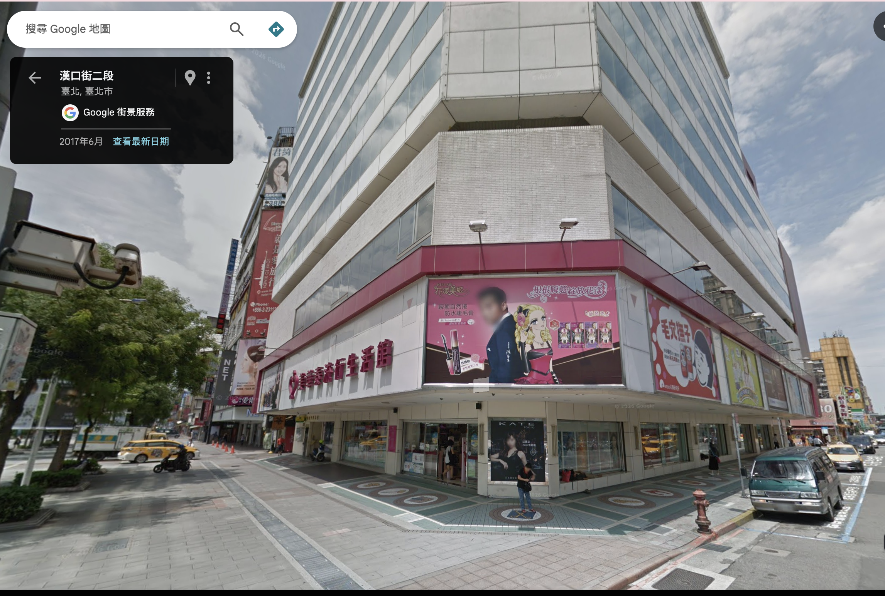
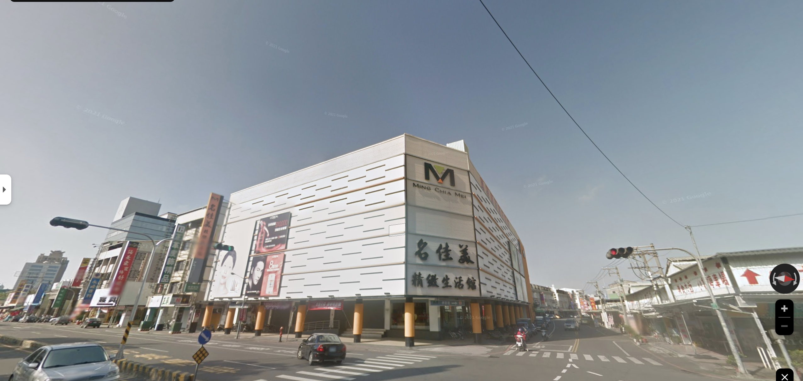
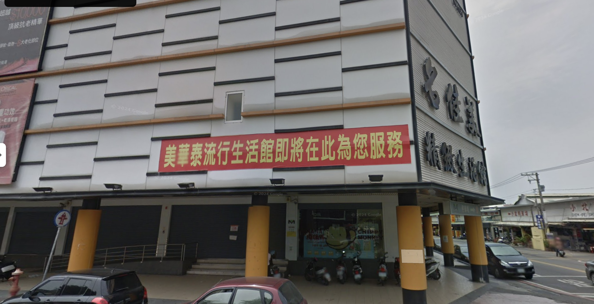
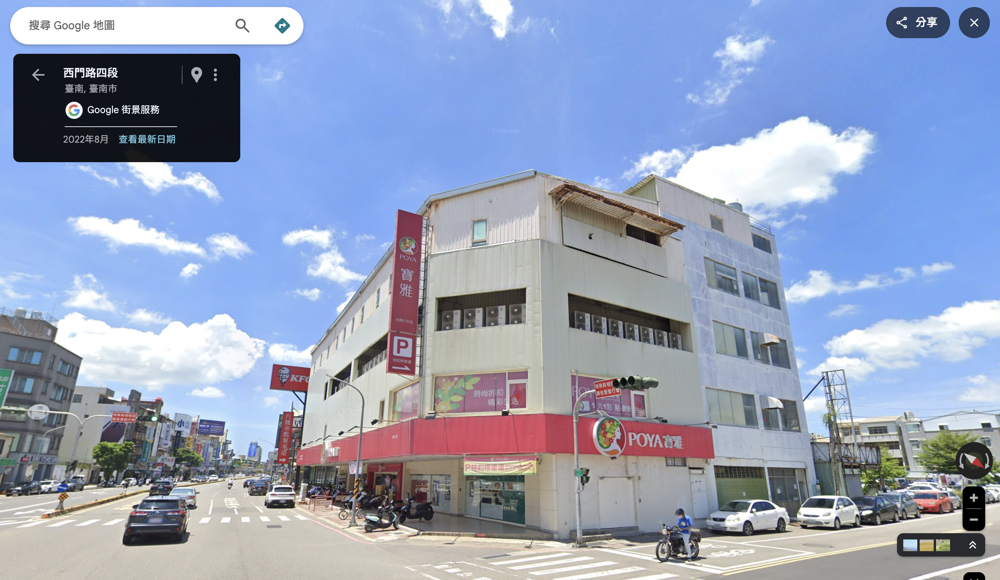
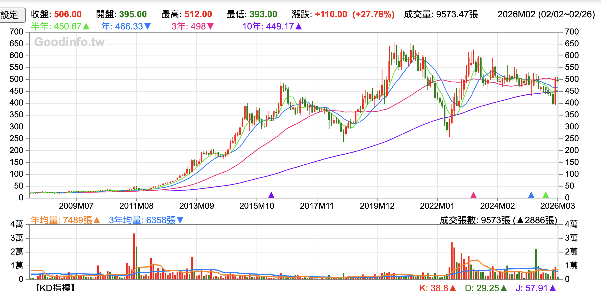

## Table of contents

## 三家店，一家人

寶雅、美華泰、名佳美——如果你在台灣長大，這三個名字至少踩過一個。它們賣的東西高度重疊：開架美妝、生活雜貨、文具飾品，店開在鬧區騎樓或商圈地下室，燈光偏白偏亮，走道塞滿促銷花車。

多數人不知道的是，這三家店背後是同一個家族。創辦人之間有姻親、有手足、有離婚後各自為戰。誰活下來、誰收攤，跟家族裡誰跟誰拆夥有直接關係。

## 中藥行、菜市場、飾品攤

陳建造是台南建昌中藥行的小孩，原本大概會接家業賣中藥。但他娶了范美津。范家做的是飾品工藝加工，耳環、戒指、胸花，自己有工廠，是這行的大盤商。陳建造開始幫老婆在菜市場擺攤賣飾品，下午扛著貨去擺、傍晚收攤回家。

這件事被二嫂看不起。她酸陳建造：「要跟你老婆出去賺女人錢，乾脆直接出去做。」陳建造被激怒，負氣出走。

1968 年，范美津拿出 8 萬元租了一間店面，把攤子升級成店，取名「美華泰飾品店」。店裡只有 5 個人：陳建造夫妻、范美津的弟弟范永興、弟媳呂青燕，再加一個員工。陳建造自己騎摩托車到全台各地鋪貨，從台東一路騎回台南是家常便飯。

小小的店面裡，髮飾和洗髮精直接放在塑膠籃裡賣。沒有什麼品牌形象，就是進貨便宜、薄利多銷。但生意做起來了。

## 美華泰擴張與分家

到了 1978 年，美華泰從飾品批發店擴大為賣女性用品和日常雜貨的零售店，規模比最初的小店面大了不少。

但陳建造夫婦沒有繼續待下去。1979 年中美斷交，陳建造帶著三個女兒舉家移民阿根廷，把美華泰的股份全數讓給小舅子范永興。

結果水土不服。1981 年，一家人搬回台南。但美華泰已經是范永興的了。

## 寶雅的誕生，1985

回到台南的陳建造夫婦重新創業。1985 年，他們創辦寶雅，英文名 Poya，一樣在台南，一樣賣女性生活用品。

乍看之下，寶雅和美華泰做的是一模一樣的生意。姊弟分家後各開各的，賣的東西差不多，搶的客人也差不多。如果只看 1985 到 1990 年代初的局面，這就是一場家族內的同業競爭，沒有人能預見三十年後的結局會差這麼遠。

## 名佳美橫空出世，1994

故事還沒完。1992 年，范永興與妻子呂青燕離婚。兩年後的 1994 年，呂青燕在台南自立門戶，創辦名佳美。

至此，一個家族裂成三條線：姊姊和姊夫開寶雅，弟弟開美華泰，弟弟的前妻開名佳美。三家店在同一座城市、同一個產業裡正面對決。如果這是電視劇，編劇會被嫌狗血。但它就是真的。

名佳美走的是更低價的路線。店面裝潢不講究，貨架擺得更密，商品單價壓得更低。網購還不存在的年代，便宜就是王道，名佳美在南部迅速展店，一度開到全台數十家。

## 三條路，三種命

2000 年代，三家店開始走向不同的方向。

寶雅走的是連鎖化、制度化的路。1993 年，陳建造的女婿陳宗成加入經營團隊。陳宗成是逢甲資工系出身，進來之後推動電腦化管理、統一採購、POS 系統、標準化店型，把一家台南的區域小店往連鎖體系的方向拉。2002 年寶雅在櫃買中心掛牌上櫃，同年轉型為「寶雅生活館」，品項從純女性用品擴大到全家人的生活雜貨，拉高客單價也拉寬客群。掛牌之後一路往北展店，從區域品牌變成全台連鎖。

美華泰走的是另一種節奏。范永興有句話：「有多少店長，就開多少店。」美華泰所有店長都從基層升起，他堅持人才養成到位才開新店。這套做法穩紮穩打，但擴張速度遠不如寶雅。美華泰也更聚焦在進口日韓商品和流行飾品，鎖定年輕女性。到了電商崛起、藥妝通路（屈臣氏、康是美）遍地開花的年代，美華泰的客群被兩面夾擊：想要品質的去了藥妝店，想要便宜的上了網路。

2003 年，這三家打了十幾年的親戚竟然聯手了。當時屈臣氏在台灣已經開到四百多家，對本土生活百貨形成壓倒性的威脅，寶雅、美華泰、名佳美決定聯合採購，用量壓價，一起對抗外商。家族恩怨暫時擱一邊，先活下來再說。

但聯手沒能改變各自的體質。名佳美的困境來得最早。全盛時期北中南開了近 26 家店，年營業額數十億。到了 2014 年，業績只剩全盛期的四分之一，房租和人力漲了，商品單價卻壓在那裡拉不上去。低價本來是武器，到後面變成枷鎖。2014 年 3 月，名佳美 12 家門市同時關閉。

范永興出面頂下了部分店面和員工，把它們併進美華泰。離婚二十多年後，他替前妻收拾殘局。

## 終局

美華泰撐到了 2020 年。2017 年陸客來台限縮後，西門町那種仰賴觀光客的大店首先撐不住，2018 年起陸續撤出。2020 年初，新冠疫情讓來客數再往下掉，美華泰在 3 月通知供應商：全台 15 家店將在 6 月底前分兩階段全數關閉。

同一年 7 月，鴻海旗下的台灣夏普宣布收購美華泰品牌和 145 萬會員資料，計畫轉型為日系生活百貨電商。范永興的美華泰實體店收攤了，但品牌名字換了一個主人繼續活在網路上。

也是同一年，寶雅的股價衝上歷史高點 616 元。

到了 2025 年，寶雅全年營收 253 億元，EPS 29.54 元，年增超過五成。全台門市從美華泰歇業時的兩百多家開到 470 家，2026 年要破 500 家。公司自己評估台灣市場可以容納 800 家。市值五百多億，每年把八成以上的獲利配回給股東。

2002 年掛牌時，寶雅的股價在個位數到十幾元之間。二十多年後站上近 500 元，從最低點 10 元算起，漲了將近 50 倍。

## 贏在哪裡

幾件事拉開了差距。

寶雅很早就在建後台系統：統一採購、POS、會員資料庫、標準化店型。這些東西不酷，但連鎖零售要規模化就是靠這些。美華泰和名佳美在這方面慢了很多。

品類的擴張時機也準。2002 年從「女性用品店」改叫「生活館」，加進家庭清潔、食品、寵物用品，客群一下子從年輕女性擴大到整個家庭。屈臣氏和康是美崛起的時候，寶雅靠更大的坪數、更雜的品項和更低的價格帶去跟它們區隔，沒有正面硬撞。美華泰碰到同樣的壓力，守住既有的做法不動。

會員的黏性也值得看。寶雅的金卡會員只佔整體的 11%，但貢獻了近四成營收。2025 年電商營收年增近五成，雖然佔比還只有 2% 出頭，線上線下的整合已經開始拉動回購。毛利率 45%、營業利益率超過 15%，在台灣零售業裡算頂段班的數字。

## 家族的影子

陳建造從阿根廷回來後沒有要求拿回美華泰的股份，另起爐灶，寶雅從第一天起就沒有跟舊公司糾纏不清的問題。范永興守著美華泰的既有盤子，穩，但也就這樣了。呂青燕離婚後從零開始，靠低價打出一片天，最後卻被成本結構拖垮。

三個人都有本事開店做生意。差別在於誰比較早把行不通的做法丟掉。寶雅丟得比較快，所以活下來了。

## 相關影片

https://www.youtube.com/watch?v=CNYGyg-yVxU
