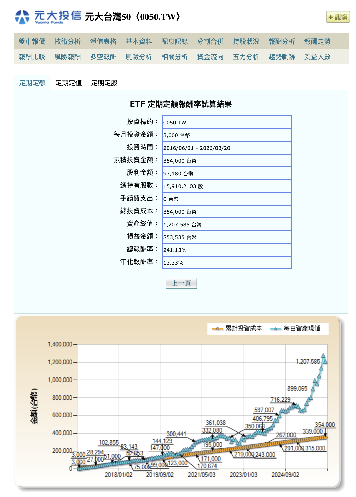

在台灣股市，買賣股票以「張」為單位，一張等於 1,000 股。[台積電](https://zh.wikipedia.org/wiki/台灣積體電路製造)股價站上 500 元，買一張就要 50 萬元。這道門檻把大多數人擋在外面。

但過去幾年，台灣政府一直在做一件事：把這道門檻往下降。2017 年開辦定期定額，2020 年開放盤中零股交易，2024 年撮合間隔縮短至 5 秒。每隔一兩年就推一次改革，進入股市的最低金額從數十萬降到幾百元。

降門檻不代表發禮物。投資就是拿出自己的錢，承擔風險，換取參與經濟成長的機會。政府把門打開了，走不走進去、能不能堅持，還是看你自己。

這篇文章整理這些年零股交易制度的變革，看看門檻是怎麼一步步降下來的。

## Table of contents

## 變革時間線總覽

**2017/1/16｜開放定期定額購買股票及 ETF**
→ 小額自動投資機制啟動

**2020/10/26｜開放盤中零股交易**
→ 零股從盤後走入盤中，每 3 分鐘撮合

**2022–2024｜三年三次提速**
→ 撮合間隔從 3 分鐘 → 1 分鐘 → 5 秒，資訊揭露從 10 秒 → 5 秒

**2026/3/30｜零股可作為融資融券抵繳擔保品**
→ 提升零股資產的運用彈性

---

## 各階段變革詳解

### 2017/1/16 — 定期定額制度啟航

**變動前的困境：**
投資人若想定期投入資金買股票，只能每月手動下單，容易因市場波動而猶豫不決，或乾脆放棄。

**變動後的改善：**
[證交所](https://zh.wikipedia.org/wiki/臺灣證券交易所)增訂「證券商受託辦理定期定額買賣有價證券作業辦法」，投資人與券商簽約後，券商會在約定日期自動買進股票或 ETF，實現「設定後就忘記」的紀律投資。

這項制度讓投資從一次性的大決策變成日常的小習慣。你不需要存到 50 萬才開始，每月 3,000 元就能啟動。

對上班族來說，自動扣款省去盯盤的時間。對投資新手來說，不用煩惱什麼時候進場，時間會幫你攤平成本。

---

### 2020/10/26 — 盤中零股交易元年

**變動前的限制：**
零股僅能在盤後 13:40 至 14:30 交易，且一天只有一次撮合機會（14:30 集合競價）。投資人下單後只能聽天由命，無法即時反應市場變化。

**變動後的突破：**
盤中 9:00 至 13:30 也能交易零股，9:10 起第一次撮合，之後每 3 分鐘以集合競價方式撮合，每日約 86 次成交機會。同時每 10 秒揭露模擬撮合資訊，讓投資人掌握市場動態。

過去零股交易像是被藏在角落的次等服務，現在它走進了正常交易時段。

盤中零股實施後，零股交易日均成交金額從約 2.23 億元成長至近 30 億元，成長超過 12 倍。21 至 30 歲族群交易戶數成長約 5.6 倍。門檻降低後，年輕人確實走進來了。

用幾百元就能買進台積電、[大立光](https://zh.wikipedia.org/wiki/大立光電)，也能用更低的成本同時佈局好幾檔個股。

---

### 2022–2024 — 三年三次提速

盤中零股開放後，接下來三年的改革都在做同一件事：讓零股的交易體驗追上整股。

| 日期       | 變革內容                      | 效果                        |
| ---------- | ----------------------------- | --------------------------- |
| 2022/12/19 | 撮合間隔 3 分鐘 → 1 分鐘      | 每日撮合機會 86 次 → 260 次 |
| 2023/11/27 | 模擬撮合資訊揭露 10 秒 → 5 秒 | 投資人獲得更即時的參考資訊  |
| 2024/12/2  | 撮合間隔 1 分鐘 → 5 秒        | 交易體驗趨近整股逐筆交易    |

從 3 分鐘到 5 秒，撮合間隔縮短了 36 倍。現在買零股的體驗，跟買整張股票已經幾乎沒有差別。

對投資人來說，成交價格更貼近預期，定期定額的委託成交效率也跟著提高。

---

### 2026/3/30 — 零股價值解鎖

**變動前的閒置：**
零股僅能持有或賣出，無法用於信用交易的擔保，放在那裡什麼都做不了。

舉個例子：台積電一股大約 2,000 元，你持有 900 股就等於 180 萬元的資產。同樣 180 萬，如果你買的是[中鋼](https://zh.wikipedia.org/wiki/中國鋼鐵)（股價約 20 元），那是 90 張整股，可以拿來當擔保品。但台積電那 900 股零股？不行。同樣的市值，待遇完全不同。台股高價股越來越多，這個問題只會越來越明顯。

**變動後的活化：**
零股可作為融資自備款或融券保證金差額的抵繳擔保品。證交所也明訂計價標準，在無成交或停牌時仍有估值依據。

長期存股的人累積的零股終於可以拿來當擔保品，不必為了追繳而急著賣掉持股。做信用交易的人也多了一個擔保品來源。

---

## 綜合效益分析

### 年輕人真的進場了

盤中零股實施後，21 至 40 歲投資人占零股交易戶數近五成，整股交易只有三成。過去買一張台積電要數十萬元，現在用幾百元就能成為股東。

### 定期定額從無到有

從 2017 年開辦至今，定期定額單月成交金額從開辦首月的 14 萬餘元成長至超過 140 億元。做法很單純：設定自動扣款，不管漲跌都投入，剩下的交給時間。

### 小額也能分散風險

過去想要分散投資 10 檔股票，可能需要數百萬資金。現在透過零股，用幾萬元就能同時持有好幾檔個股。

### 還沒做完的事

目前整股和零股之間仍然存在零整價差，同一檔股票在零股市場的成交價格往往和整股不同。這個價差代表零股投資人還是在付出額外的交易成本。從撮合間隔到擔保品資格，制度已經走了很長的路，但要讓零股真正和整股站在同一條線上，縮小零整價差是各方需要繼續努力的方向。

---

## 結語：每月 3,000 元的十年

這張圖是[元大台灣 50](https://zh.wikipedia.org/wiki/元大台灣卓越50證券投資信託基金)（0050.TW）的定期定額試算結果。每月投入 3,000 元，從 2016 年 6 月持續到 2026 年 3 月，將近十年。累積投入 354,000 元，資產總值 1,207,585 元，總報酬率 241%，年化報酬率 13.33%。

35 萬變成 120 萬。沒有買到飆股，沒有精準抄底，就是每個月固定投入 3,000 元，然後什麼都不做。

政府花了將近十年，把門檻從「一張 50 萬」降到「每月 3,000 元」。但降門檻不是發福利，你得自己拿出錢來，承擔市場的起伏，忍住不在下跌時賣出。沒有白吃的午餐，只是現在你不需要準備一大筆錢，也能開始。

---

_資料來源：[臺灣證券交易所](https://www.twse.com.tw/)、[金融監督管理委員會](https://zh.wikipedia.org/wiki/金融監督管理委員會)、[元大投信](https://zh.wikipedia.org/wiki/元大證券投資信託)_
_最後更新：2026 年 1 月_
