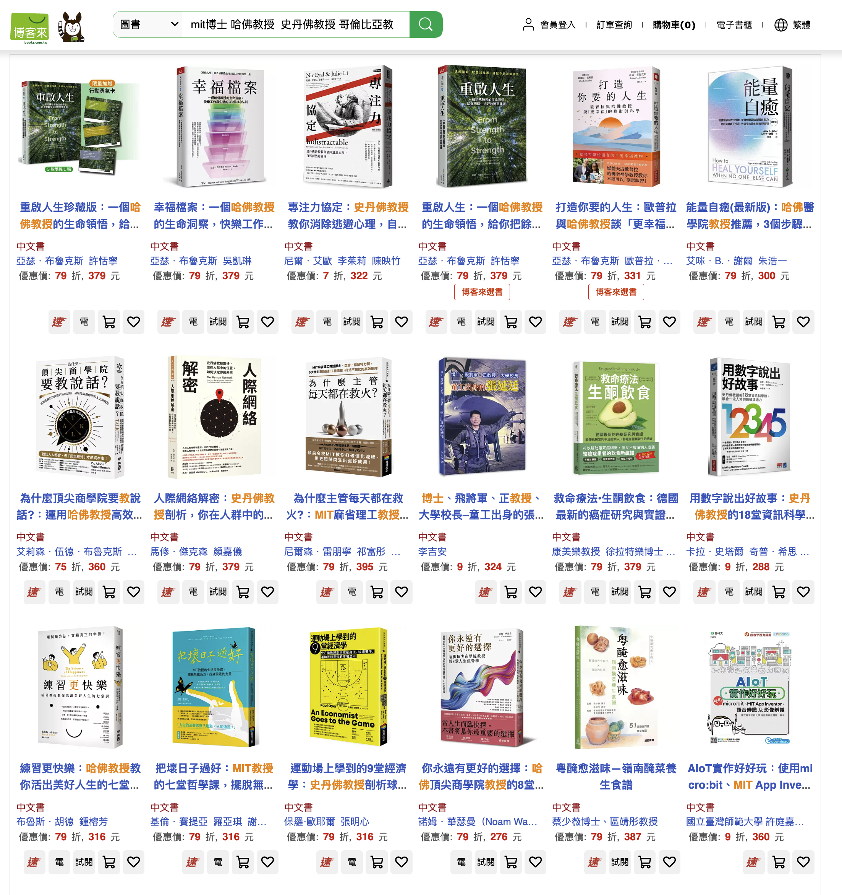

## Table of contents

## 七個書名，一個共同點

先看一張表。左邊是七本書的英文原名，右邊是它們在台灣出版的中文版書名：

| 英文原名                                                                                                        | 台灣中文版書名                                                                     |
| --------------------------------------------------------------------------------------------------------------- | ---------------------------------------------------------------------------------- |
| The New Trading for a Living: Psychology, Discipline, Trading Tools and Systems, Risk Control, Trade Management | 職業交易人的養成：國際交易大師艾爾德博士的心法與實戰完整指南                       |
| From Strength to Strength: Finding Success, Happiness, and Deep Purpose in the Second Half of Life              | 重啟人生：一個哈佛教授的生命領悟，給你把餘生過好的簡單建議                         |
| The Friction Project: How Smart Leaders Make the Right Things Easier and the Wrong Things Harder                | 摩擦計畫：史丹佛教授的零內耗管理，讓正確事變簡單、錯誤事變難                       |
| The History of Ideas: Equality, Justice and Revolution                                                          | 世界還能變好嗎？劍橋大學教授談 12 位時代思想巨人，開展平等、正義與革命的關鍵思考   |
| How to Win at College: Surprising Secrets for Success from the Country's Top Students                           | 深度學習力：學歷貶值時代，MIT 博士教你從大學就脫穎而出的 75 個成功法則             |
| 15 Tools to Turn the Tide: A Step-by-Step Playbook for Empowered Negotiating                                    | 逆襲談判：哥倫比亞大學教授的 15 個協商工具，扭轉劣勢、提升籌碼，達成你想要的結果！ |
| Wealth, Poverty and Politics: An International Perspective                                                      | 誰製造了貧窮？史丹佛經濟學家對貧富不均的思辨                                       |

先別急著往下讀。左右對照掃一遍，你注意到什麼了嗎？

提示：右邊那一欄，有一樣東西出現了七次，左邊一次都沒有。

答案是學術頭銜。哈佛教授、史丹佛教授、劍橋大學教授、MIT 博士、哥倫比亞大學教授、史丹佛經濟學家，再加一位艾爾德博士，一字排開，像是書店裡開了一場世界名校的招生說明會。英文原名靠概念和主題賣書，中文書名靠作者在哪裡教書賣書。原作者花心思取的名字，摩擦也好、力上加力也好，全部讓位給任職機構。

這不是個別編輯的品味問題。七本書、不同出版社、不同領域，套的是同一個公式：權威頭銜，加一個焦慮或疑問的鉤子，加數字化的方法（75 個法則、15 個工具、12 位巨人），最後是對「你」的承諾。「給你把餘生過好」「達成你想要的結果！」驚嘆號都幫你加好了。

公式如此一致，值得問的就不是「哪家出版社比較沒品」，而是：這個公式為什麼在台灣書市活得這麼好？

## 買書的人在買什麼

先講需求端。台灣讀者對機構頭銜的反應，是被整個社會制度訓練出來的。我們從小活在一個用考試分數和學校排名替人分類的系統裡，「台大畢業」四個字可以在履歷上省掉一千字的自我介紹。這套邏輯內化之後，「哈佛教授」就成了品質的代理指標：我不需要判斷這本書的論證好不好，哈佛已經替我判斷過這個人了。

對翻譯書來說，這個捷徑又特別必要。外國作者對台灣讀者多半是陌生人。[Arthur Brooks](https://en.wikipedia.org/wiki/Arthur_C._Brooks) 在美國是《[大西洋月刊](https://www.theatlantic.com/)》的專欄明星，在台灣沒幾個人聽過；[Robert Sutton](https://casbs.stanford.edu/people/robert-i-sutton) 在矽谷管理學圈是老牌人物，台灣讀者只認得「史丹佛」三個字。出版社面對的是一個資訊不對稱的市場：作者的個人品牌運不過來，那就運他的機構品牌。在台灣書市，Sutton 這個姓帶不動銷量，「史丹佛」三個字帶得動。

再來是購買情境。今天多數人第一次看到一本書，不是在書店翻到，是在博客來的搜尋列表或社群媒體的轉貼圖上。一張縮圖，停留三秒。書名在這三秒內要完成過去書腰加上店員推薦的全部工作。它不能只是書的名字，它得是完整的電梯簡報，三秒內講清楚誰寫的、能替你解決什麼問題。

於是書名學會了對讀者說話。原文書名描述書的內容，中文書名對讀者許諾效益。書名從「這本書在講什麼」變成「這本書能為你做什麼」，因為在三秒鐘的注意力市場裡，後者的轉換率高。

還有焦慮。「學歷貶值時代」和「零內耗」這種詞，描述的是目標讀者的心理狀態，而不是書的內容。書名先把你的焦慮說出來，再把書呈現為解藥。這招在自我成長書區用了幾十年，現在連思想史（《世界還能變好嗎？》）和經濟學（《誰製造了貧窮？》）都套上了同一件外衣。

## 賣書的人在賣什麼

供給端的邏輯更直白。中文書名不是譯者取的，是行銷會議開出來的。譯者翻的是內文，書名是商品命名，決定權在編輯部和行銷部。原書名是作者的論點，中文書名是出版社的商業判斷，兩者本來就服務不同的主人。

更關鍵的是市場結構。台灣一年出版數萬種新書，單書平均銷量卻逐年下滑，多數書的生命週期是上市後的四到六週。在這種環境裡，書名的功能徹底改變了：它是搜尋關鍵字的集合，也是社群轉貼時不需要附上任何說明就能自我解釋的一句話。「深度學習力」一個書名同時蹭到 Cal Newport 在台灣的「深度工作力」品牌線和 AI 時代的熱門關鍵字，這種取名是算過的。

這件事可以直接驗證。把幾個頭銜當關鍵字丟進博客來的搜尋列，撈回來的不是零星幾本，是一整頁。

橘色命中的位置幾乎都在書名前段，因為搜尋列表和社群縮圖都會把後半截掉，擺後面等於沒寫。

而公式的一致性本身就是市場篩選的結果。你在書店看到的書名長這樣，是因為不長這樣的書名沒能讓書活下來。每一本用「哈佛教授教你」句式賣爆的書，都在替下一本同句式的書鋪路。編輯不是沒有美學判斷，是美學判斷輸給了銷售報表。

### 當頭銜是後製的

公式一旦壓倒內容，書名和書的關係就開始鬆動。

頭銜可以是後製的。[Cal Newport](https://calnewport.com/) 寫《How to Win at College》時還是達特茅斯的大學生，這本書的原始賣點正是「頂尖學生的秘訣」，一個學生寫給學生的視角。中文版用他多年後才拿到的 MIT 博士學位回頭貼標，把一本學生手記包裝成博士指南。[Thomas Sowell](https://www.hoover.org/profiles/thomas-sowell) 任職於史丹佛校園裡的胡佛研究所，「史丹佛經濟學家」技術上說得通，行銷上則樂於讓你以為他是史丹佛的教授。

頭銜也可以是挑出來的。《逆襲談判》的作者 [Seth Freeman](https://www.stern.nyu.edu/faculty/bio/seth-freeman) 在紐約大學史登商學院掛的是兼任副教授，同時在哥倫比亞大學的國際與公共事務學院授課，中文書名挑了聽起來比較氣派的那一邊。[艾爾德](https://www.elder.com/about)的博士則是另一種情況：他確實有醫學博士學位，在紐約當過精神科醫師，也在哥倫比亞大學教過書，只是這個學位跟外匯和技術分析沒有關係。頭銜在這裡不必跟書的主題相干，夠響亮就行。

書名甚至可以當魚餌用。《Wealth, Poverty and Politics》的中文版叫《誰製造了貧窮？》，但 Sowell 全書的核心論點恰恰在質疑這個問題的前提。他認為貧窮是人類的預設狀態，不需要被「製造」，真正需要解釋的是財富如何產生；把貧窮歸咎於某個加害者，正是他花了幾百頁要拆解的思考方式。出版社顯然知道「誰製造了貧窮」這個問題在台灣讀者心中有市場，於是拿它當餌，把對這個問題有既定答案的讀者，釣進一本反駁這個問題的書裡。餌和魚肚裡的東西不是同一回事，釣客本來就不在乎。

## 共謀的代價

把兩端接起來看，這是一個沒有壞人的共謀。

讀者面對資訊過載，用頭銜當捷思，省下判斷成本，這是理性的。出版社面對萎縮的市場，用公式極大化三秒鐘的轉換率，這也是理性的。但兩個理性加總起來，回饋迴圈就鎖死了：讀者只看得到公式化的書名，於是只對公式化的書名有反應，於是出版社更確信只有公式有效。書市的語言收斂成一種。

最容易看見的損失是文學性。《From Strength to Strength》出自詩篇八十四篇，走過流淚谷、力上加力的意象，在《重啟人生》裡蒸發得一乾二淨。但這還是小事。

比較深的代價是，這套公式在系統性地訓練讀者辨認權威，而不是辨認論證。當每一本書都用「誰說的」來賣而不是用「說了什麼」來賣，讀者的判斷肌肉就萎縮在「誰說的」這一層。哈佛教授說的，所以值得聽。這種思考方式方便，但它跟「網紅說的所以是真的」「長輩圖說的所以要轉」在結構上是同一件事，只是訊號來源比較高級。一個習慣用頭銜過濾資訊的社會，換掉頭銜的品牌，就能被餵任何東西。

最深的代價，回到 Sowell 那本書。魚餌式書名有兩種結局：運氣好，讀者上鉤後被書本身翻轉，發現自己是被書名釣進來的，這算是一場意外的思想交鋒；運氣不好，讀者沒讀完，只記得書名，Sowell 反而成了「追究誰製造貧窮」的代言人。哪一種結局比較常見，看看社群上有多少人只憑書名轉貼書單，答案不難猜。無論哪一種，作者的論點都先被行銷折價過一次。

## 把頭銜遮起來

下次在書店或電商頁面停下來的時候，可以做個小實驗：把書名裡的頭銜遮起來，看看剩下的字還能不能說服你。如果不能，那你被說服的從來不是這本書。是那所大學，而它並沒有寫過任何一本書。
