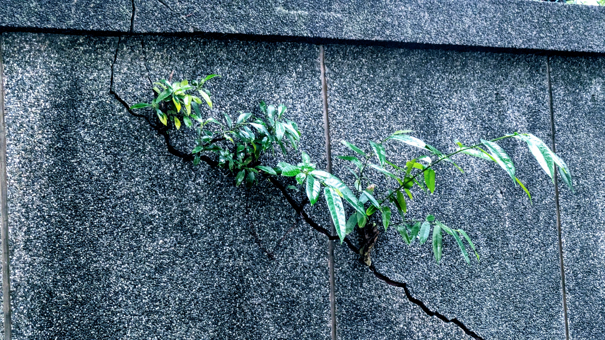

## Table of contents

## 寓言：牆與榕樹

在一個寧靜的小鎮邊緣，矗立著一堵厚實的水泥牆。這堵牆已經守護這個社區數十年，歷經無數風雨，依然堅固如初。居民們信賴這堵牆，它標示著邊界，也標示著安全。

歲月流轉，風吹日曬，加上附近日益繁忙的交通帶來的震動，偶爾還有地震的侵襲，牆面開始出現幾道細微的裂痕。這些裂痕起初如髮絲般細小，幾乎察覺不到，也絲毫不影響牆體的結構。

某個秋日，一陣風吹來了一顆榕樹種子，恰好落入其中一道裂縫。種子很小，看起來毫無威脅。春雨來臨時，種子開始發芽，一株嫩綠的小苗從裂縫中探出頭來。路過的人們甚至覺得這抹綠意為灰色的水泥牆增添了生機。

日復一日，年復一年，榕樹緩慢但堅定地生長著。它的根系開始向下、向四周延伸，尋找每一道細小的縫隙。根鬚如同無數隻看不見的手，悄悄地撬開原本緊密的水泥結構。裂縫逐漸變寬，從一條延伸到多條，從表面深入到內部。

十年過去了，榕樹已經長成一棵枝繁葉茂的大樹。人們讚嘆它的生命力，卻沒有注意到牆體已經佈滿了縱橫交錯的裂痕。直到某個風雨交加的夜晚，在一陣並不算強烈的風雨中，這堵曾經堅不可摧的水泥牆，轟然倒塌。

## 這不是寓言

這個故事有一個現實中的名字：**[統一戰線](https://zh.wikipedia.org/zh-tw/%E7%B5%B1%E4%B8%80%E6%88%B0%E7%B7%9A)**。

統一戰線，簡稱統戰，英文稱為 United Front，是中共奪取政權、鞏固統治的 **「三大法寶」**（其他兩個是「黨的建設」和「武裝鬥爭」）之一。概念源自列寧主義，毛澤東把它說得更白：

> 什麼是統一戰線？統一戰線就是把我們的人搞得多多的，把敵人的人搞得少少的。

你可能在歷史課本上讀過「[第一次國共合作](https://zh.wikipedia.org/zh-tw/%E7%AC%AC%E4%B8%80%E6%AC%A1%E5%9C%8B%E5%85%B1%E5%90%88%E4%BD%9C)」，但不一定注意到它的英文名稱就叫 [First United Front](https://en.wikipedia.org/wiki/First_United_Front)——沒錯，那就是統戰。1924 年至今剛好一百年，從國共合作到今天的網路認知戰，統戰的形式不斷演變，但邏輯從未改變：**找到裂縫，送入種子。** 這套邏輯背後，有完整的組織體系在運作：中央統戰部、地方各級統戰部門、工商聯、海外孔子學院。不是某個官員偶爾為之的外交手段，是一部永不停歇的國家機器。

沿著榕樹的生長軌跡，可以看到這部機器怎麼運作。

### 種子落入：看似無害的起點

寓言裡，種子隨風飄落，看起來毫無威脅。統戰的起手式也是如此，它從來不以敵人的姿態出現。

一場兩岸青年交流營、一趟招待地方村里長的參訪團、一個以「促進文化理解」為名的孔子學院、一筆讓利給台灣農漁產品的採購訂單。每一顆種子看起來都無害，甚至讓人感激。就像路人看見牆縫裡冒出的嫩芽，覺得是灰色水泥上的一抹生機。

但種子不是隨機飄落的。它們被精準地投向每一道裂縫。

### 發芽生根：關係的建立

種子發芽需要水分，統戰發芽需要的是**依賴**。

經濟上，中國以市場准入為誘餌，讓企業在「商機」與「政治表態」之間做選擇。這不是新手法。2005 年，中國通過《[反分裂國家法](https://zh.wikipedia.org/zh-tw/%E5%8F%8D%E5%88%86%E8%A3%82%E5%9C%8B%E5%AE%B6%E6%B3%95)》後不久，長期支持台灣本土立場的[奇美集團](https://zh.wikipedia.org/zh-tw/%E5%A5%87%E7%BE%8E%E5%AF%A6%E6%A5%AD)創辦人[許文龍](https://zh.wikipedia.org/zh-tw/%E8%A8%B1%E6%96%87%E9%BE%8D)，突然發表聲明表示「台灣、大陸同屬一個中國」。事後媒體披露，中國以查帳為由扣押多位奇美高階台幹，這份聲明是在脅迫下產生的。許文龍在發表前曾對友人落淚。當整個企業和員工的生計被拿來當籌碼，一個人的政治信念撐不了多久。

二十年後，同樣的邏輯仍在運作。2024 年 5 月，[五月天](https://zh.wikipedia.org/zh-tw/%E4%BA%94%E6%9C%88%E5%A4%A9)主唱阿信在北京鳥巢演唱會上說出「我們中國人」，時間點恰好卡在賴清德總統就職、中國繞台軍演之際。許多人對此失望或憤怒，但很少人注意到背後的結構：五月天五位成員不只是歌手，他們是[相信音樂](https://zh.wikipedia.org/zh-tw/%E7%9B%B8%E4%BF%A1%E9%9F%B3%E6%A8%82)的共同創辦人與大股東。相信音樂旗下有眾多藝人和員工，關聯企業必應創造的年營收數十億。當你不只是一個人站在舞台上，而是扛著整個集團的生計時，那句話的重量就不一樣了。這和許文龍面對的處境，本質上是同一件事。經濟依賴綁架政治表態。

經濟之外，根鬚也從其他方向伸入。

媒體上，透過收買、入股或廣告置入等方式影響台灣媒體的編輯方向。當一家電視台的主要廣告收入來自中國市場相關企業，批評中國的報導自然會「不小心」被淡化，特定立場的聲音則被放大。不需要直接下指令，經濟結構本身就會過濾內容。

文化上，學術交流看似雙向，實則不對等。當中國能決定哪些學者拿得到簽證、哪些研究計畫拿得到經費，學界對中國的批評就會逐漸變得「不合時宜」。沒有人明令禁止，只是慢慢沒人願意冒這個風險。

宗教上，透過宮廟系統，這個深入台灣每一個鄉鎮的信仰網絡，建立起難以察覺的聯繫管道。進香團、繞境活動、廟宇修繕的捐款，都可以成為建立人際關係和傳遞影響力的管道。

每一條根鬚都很細，細到不值得擔心。但它們正在向下扎根。

### 根系擴張：裂縫裡的暗手

榕樹最厲害的地方，是它能找到每一道已經存在的縫隙，然後讓它變得更寬。它不需要劈開岩石。

統戰工作的邏輯一模一樣。它不需要「製造」矛盾，只需要「利用」矛盾。台灣社會本來就存在各種分歧，貧富差距的不滿、世代之間的認知落差、族群認同的拉扯、發展不均的怨懟。這些都是民主社會的正常現象，就像牆上的髮絲裂痕，不影響結構。

但統戰會讓這些裂痕變寬。在能源轉型的辯論中推波助瀾，讓理性討論變成陣營對立；在死刑存廢的議題上煽動極端情緒，讓社會共識更難形成；在身份認同的問題上操作省籍情結，讓「我們是誰」這個問題變成武器；政黨內部的派系鬥爭、國際政治中的川粉與川黑對立，都是現成的施力點；甚至看似無關政治的議題——動物保護、重機上國道、環保、性別、兒少保護——也能被操作成製造群體對立的工具。

寓言中的牆只面對一棵榕樹。現實中，統戰同時播下數百顆種子，看哪幾顆能活下來。

### 裂縫遍佈：當結構開始鬆動

根系擴張到一定程度，改變的就不只是個別裂縫，而是整面牆的結構。

社群媒體上，假訊息與帶風向的操作已經不是新聞，但更難察覺的是「認知框架」的悄然位移。當人們開始用中共希望他們使用的方式理解問題時，根系已經深入了牆體內部。

而現在，這套滲透正在升級。2025 年，[台灣民主實驗室](https://doublethinklab.org/)分析了中國公司[中科天璣](https://therecord.media/golaxy-china-artificial-intelligence-papers)（GoLaxy）的外洩文件，揭露了一套系統：一個收錄 170 名台灣政治人物詳細檔案、約 2,300 萬筆戶政資料、13,000 個宗教團體、近 24,000 個民間組織的資料庫；一套能將人物自動分類為「強硬派」「友好派」「搖擺群」的 AI 系統；至少 100 個能用華語、台語、英語與目標受眾互動的虛擬角色。這已經不是人工操作的網軍了。這是一部能自動偵測政治趨勢、選定目標、生成內容、再透過大量假帳號發布的全自動機器。大數據分析讓這種滲透變得精準化、個人化，每個人看到的內容都不同，但方向一致。

表面上，榕樹為灰色的牆面帶來了枝繁葉茂的綠意。正如統戰活動總是以正面形象示人：文化交流促進理解、經貿合作互利雙贏。但在這些綠意之下，牆體已經佈滿了縱橫交錯的裂痕。

統戰以十年、二十年為單位布局。當人們終於察覺到危險時，往往根系已深、積重難返。

## 你看見裂縫了嗎

寓言的結局是牆的倒塌。但現實不必如此，前提是我們能認出榕樹。

### 最危險的誤認

有些人不只看不見榕樹，還主動替它澆水。

國民黨立委[陳玉珍](<https://zh.wikipedia.org/wiki/%E9%99%B3%E7%8E%89%E7%8F%8D_(%E9%87%91%E9%96%80)>)在 2025 年 3 月 26 日公開表示，統戰在中國的語境中並不帶有敵意，反而是一種將敵對者轉化為盟友的策略。她甚至呼籲台灣民眾不必對統戰感到恐懼，應該歡迎中國大陸人民來台，藉此對中國「進行統戰」。

這種說法忽視了一個根本事實：中共統戰背後有整個國家機器支撐，中央統戰部、各級地方部門、工商聯、僑聯、台聯，是一套完整的組織體系。台灣不可能用同樣的規模和手段進行對等的「反向統戰」。而中共統戰的最終目標是消滅台灣的民主體制，不是「交流」，也不是「交朋友」。

把統戰說成「把敵人變朋友」的溝通方式，就是把榕樹的破壞性生長說成「為牆面增添綠意」。這種認知上的錯誤，正是統戰最希望達到的效果。

### 護牆之道

理解了榕樹的生長機制，我們就知道該怎麼保護我們的牆：

修補裂縫，正視社會內部矛盾，不讓正常的民主歧見被擴大成不可彌合的對立。定期檢查，及早辨識哪些交流是正常的往來，哪些背後有組織性的滲透意圖。強化結構，深化民主教育，提升公民對資訊操作的辨識能力。主動防護，在開放中保持清醒，而不是築起高牆閉關鎖國。

沒有任何民主國家可以完全隔絕外來影響。關鍵在於能不能分辨哪些是正常的交流合作，哪些是包裝過的統戰滲透。這種分辨能力，需要整個社會一起練。

> 下次路過一面牆，看見裂縫裡的那抹綠意時，多看一眼。牆不會自己開口求救，但裂縫一直都在，只要你願意看。
