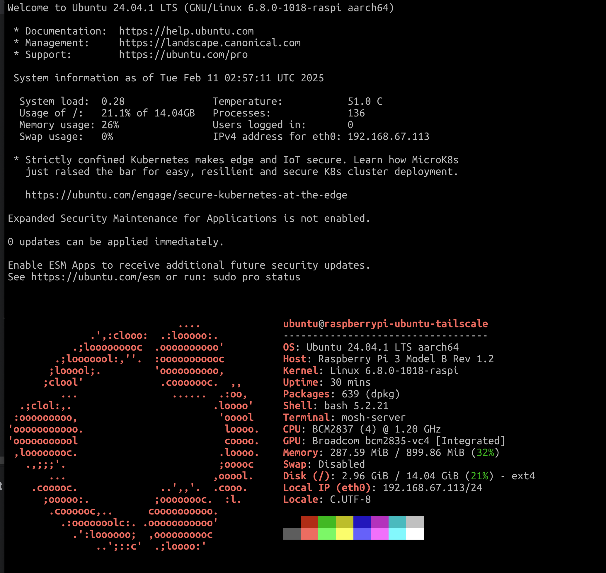

## Table of contents

## 設定方式

在 `/etc/profile.d/` 下建立 `fastfetch.sh` ，填入以下內容：

```bash
#!/bin/bash

fastfetch
printf "\n\n"
```

將 `/etc/profile.d/fastfetch.sh` 檔案權限設定為可被執行：

```bash
chmod +x /etc/profile.d/fastfetch.sh
```

下次登入 Ubuntu 就會出現如下畫面：


